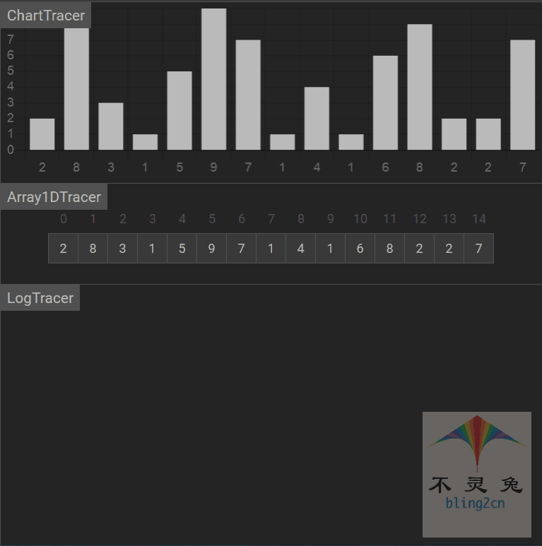
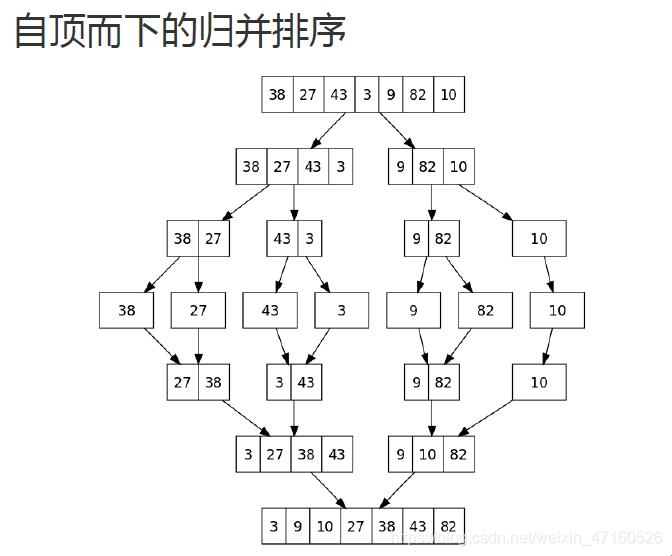

# 常用算法

参考：知乎，菜鸟教程

## 1 排序算法

冒泡，插入，选择，希尔，快排，堆排，归并排序


### 1.1 冒泡排序


对一个序列多次遍历，逐个比较相邻的两个元素并对排错的进行交换。好处是如果序列一开始就是有序的，那么算法直需要遍历一遍

时间复杂度：最优情况数组已经有序O(n)。最差情况数组完全逆序O(n^2)。平均O(n^2)

空间复杂度：O(1)

相同的两个数不会发生交换，**因此是稳定的**


### 1.2 选择排序


**每次在待排序的序列中寻找最小的元素，与待排序列首元素交换**。直到所有待排序的数据排完。

时间复杂度：**最优情况数据已经有序，每一轮也要遍历剩下的整个序列**O(n^2)。最差情况相同O(n^2)。平均情况O(n^2)

空间复杂度：O(1)

有横跨很多数字的交换，**因此是不稳定的**


### 1.3 直接插入排序


将整个序列分为两部分：有序部分和无序部分。

每一轮选择无序部分的第一个元素，在有序部分中向前扫描，寻找合适的位置插入

时间复杂度：最优情况数组已经有序，则在无序部分遍历到每个元素时，直接就是合适的位置，都不需要向前搜索O(n)。**最差情况O(n^2)**。平均情况O(n^2)

在往前找合适位置插入的时候，相同数字的原排序不变。**因此是稳定的**

### 1.4 希尔排序



也称为缩小增量插入排序。一开始选择一个较大的增量，然后逐渐缩小增量。时间复杂度优于O(n^2)，但不如O(nlogn)

**是不稳定的**


代码实现：

```c++
template <typename Comparable>
void shellsort(vector<Comparable> & a)//希尔排序
{
    for(int gap=a.size()/2;gap>0;gap/=2)
    {
        for(int i=gap;i<a.size();i++)
        {
            Comparable tmp=a[i];
            int j;

            for(j=i;j>=gap&&tmp<a[j-gap];j-=gap)
            {//向前以gap为增量搜索，直到找到一个小于等于tmp的元素才停止
             //否则就将前一个元素后移一个增量
                a[j]=a[j-gap];
            }
            a[j]=tmp;//最终j指向的就是合适的下标
        }
    }
}
```


### 1.5 归并排序




分治法。最坏时间复杂度为O(nlogn)，平均时间复杂度为O(nlogn)且与序列无关，即使是在序列已经有序的情况下时间复杂度也是O(nlogn)

空间复杂度O(n)，**在merge过程中需要一个辅助数组**。

在merge的过程可以保证相同的数字原序不变，**因此是稳定的**

```c++
	void mergeSort(vector<int>& nums,vector<int>& tmp,int left,int right)
    {
        if(left>=right)
            return;
        int mid=(left+right)/2;
        mergeSort(nums,tmp,left,mid);
        mergeSort(nums,tmp,mid+1,right);
        int i=left,j=mid+1;//取左右两个数组的起点
        int k=0;
        //合并左右两个升序数组
        while(i<=mid && j<=right)
        {
            if(nums[i]<=nums[j])
            {
                tmp[k]=nums[i];
                k++;
                i++;
            }
            else
            {
                tmp[k]=nums[j];
                k++;
                j++;
            }
        }
        while(i<=mid)
        {
            tmp[k]=nums[i];
            k++;
            i++;
        }
        while(j<=right)
        {
            tmp[k]=nums[j];
            k++;
            j++;
        }
        //从临时数组拷贝回去
        for(int i=0;i<(right-left+1);i++)
            nums[left+i]=tmp[i];
    }
```


### 1.6 快速排序

快速排序的最坏情况时间复杂度是O(n^2)，例如选取枢纽一直选最左或最右元素，然后序列由刚好有序。

最好情况：每回选择的主元都能够将序列均等地分为两份。时间复杂度就是O(nlogn)

由于**涉及交换操作，因此是不稳定的排序**

没有使用额外的存储空间，因此空间复杂度是O(1)


代码实现：

```c++
int partition(vector<int>& nums,int left,int right)
{
    //随机选取一个下标作为主元
    int pivotIndex=rand()%(right-left+1)+left;
    int pivot=nums[pivotIndex];
    swap(nums[right],nums[pivotIndex]);//把主元放到最右边
    int i=left-1,j=left;//i指向主元左半部分的最后一个元素
    for(;j<=(right-1);j++)
    {
        if(nums[j]<=pivot)
        {
            i++;
            swap(nums[i],nums[j]);
        }
    }
        
    swap(nums[i+1],nums[right]);
    return i+1;//返回主元所在的下标
}

void quickSort(vector<int>& nums,int left,int right)
{
    if(left<right)
    {
        int pos=partition(nums,left,right);
        quickSort(nums,left,pos-1);
        quickSort(nums,pos+1,right);
    }
}

vector<int> sortArray(vector<int>& nums) 
{
    int n=nums.size();
    srand((unsigned)time(NULL));//初始化随机数种子
    quickSort(nums,0,n-1);
    return nums;
}
```


### 1.7 堆排序

二叉堆。

```c++
void headDown(vector<int>& nums,int i,int n)
{//下溯直到两个子结点都小于当前结点
	while(i<n)
    {
    	int left=2*i+1;
        int right=2*i+2;
        int maxKid=i;
        //寻找两个子结点中更大的
        if(left<n && nums[left]>nums[maxKid])
            maxKid=left;
        if(right<n && nums[right]>nums[maxKid])
            maxKid=right;
        if(maxKid==i)
            break;
        //与更大的子结点交换
        swap(nums[i],nums[maxKid]);
        i=maxKid;
    }
}
void buildHeap(vector<int> &nums,int n)
{//构造大顶堆，从n/2-1开始构造
    for(int i=n/2-1;i>=0;i--)
        headDown(nums,i,n);
}

void heapSort(vector<int>& nums)
{
    int n=nums.size();
    buildHeap(nums,n);
    for(int i=n-1;i>=1;i--)
    {
        swap(nums[i],nums[0]);//把堆顶和尾部交换
        n--;
        headDown(nums,0,n);//对被交换上来的元素进行下溯
    }
}
```


### 1.8 基数排序


从个位开始按照数字放进桶里排序，有些数字没有的位则用视为0。

每个桶可使用队列实现。


### 1.8 桶排序


## 2 图论算法

dijkstra，floyd，最小生成树，拓扑排序

dijkstra：

每一轮从未确认结点中选择距离根结点最短的点，然后尝试更新它所邻接的点

## 3 其它算法

洗牌算法