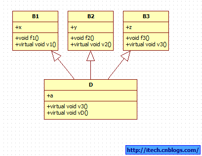
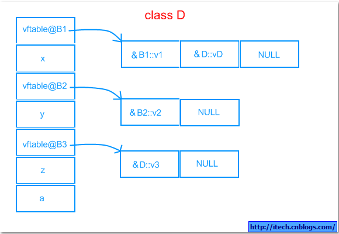

# C++笔记

参考资料：《C++ Primer》，菜鸟教程

## 1 一些点

### 1.1 static

**static静态全局变量**

- 初始化过则存储在data段，未初始化则存在bss段
- 可以被修改
- 仅在其声明的文件内可见

**static静态局部变量**

- 普通的局部变量保存在栈上，而static静态局部变量保存在data段或bss段
- 每次调用函数时访问的都是同一个static局部变量

**static函数**

- static函数仅在其声明的文件内可见
- 其他文件可以有与其同名的函数，不会冲突

--------------------------类----------------------------

**类里面的static数据成员**

- 无论有多少个对象，**类里的static数据成员只会有一份拷贝，它保存在data段中**。
- 它的初始化需要使用int class::member=xxx（＜数据类型＞＜类名＞::＜静态数据成员名＞=＜值＞）
- 由于只存在一份拷贝，可以节省空间。同时也没进入全局名字空间，不会与其他全局名字冲突

**类里面的static成员函数**

- 普通的类成员函数会隐式含有一个this指针，用于访问对象的成员。但static成员函数不含this指针，它与对象无关。
- static成员函数只能访问类的static数据成员和static函数，不能访问非static成员
- 非static成员可以访问static成员，反之不行
- 代码保存在text段

### 1.2 const

常量指针：int * const ptr=&x，即指针本身是常量

指向常量的指针：const int * ptr=&x，即指针指向的对象是常量

**const全局变量**

- 存储在全局存储空间**.rodata段**
- 无法通过任何形式对其进行修改

**const局部变量**

- 存储在栈上
- **无法直接进行修改，但可以通过指针间接修改**
- 也就是说只是在编译器层面禁止修改，内存层面没有禁止修改

### 1.3 volatile

​		使用volatile关键字声明的变量，**可以防止编译器优化将其从内存装入寄存器，从而使得每回对其操作时都必须从内存取出**。

​		**volatile不是同步手段，不适合用于多线程**。因为期待volatile解决竞态条件是有很大风险的，C++11标准中明确指出解决多线程竞争问题应当用原子操作或互斥锁。volatile不会对多线程访问和修改进行限制，因此仍然可能会因为线程切换等造成读写问题

​		**volatile用于修饰一些因为程序不可控因素会发生变化的变量，因此要提醒编译器不要对其擅自优化**。

### 1.4 extern

extern（外部的）声明变量或函数为外部链接，即该变量或函数名在其它文件中可见

不能extern其他文件的static变量或函数

### 1.5 mutable

声明为mutable类数据成员，尾部加上const的类成员函数可以对其进行更改。

也就是告诉编译器，这一变量不算对象的内部状态，可以允许const成员函数更改。

### 1.6 explicit

主要用于修饰类中一些单参数的构造函数，禁止通过赋值发生隐式构造。必须显式的调用构造函数

### 1.7 四种cast

#### 1.7.1 static_cast

static_cast < type-id > ( expression )

该运算符把 expression 转换为 type-id 类型，但没有运行时类型检查来保证转换的安全性

- 用于**基本数据类型之间的转换**，如把 int 转换成 char，把 int 转换成 enum。这种转换的安全性也要开发人员来保证
- 可以**将派生类指针转为基类指针，这种上行转换是安全的**。可以强制将基类指针转为派生类指针，但由于缺少动态类型检查，这种下行转换在这里是不安全的。
- 可以将一个类型的空指针转换为另一个类型的空指针

#### 1.7.2 dynamic_cast

**主要用于将基类指针或引用安全的转换为派生类的指针或引用**。

应用场景：现在有一个基类指针指向一个派生类对象，但我想要访问派生类的一个非virtual函数，那就要先转换。

转换指针成功会得到一个正确的派生类指针，转换失败会返回nullptr。

转换基类引用失败会抛出异常。

dynamic_cast**依赖于虚函数表里的RTTI信息**，也就是说如果基类没有virtual方法，就无法获得指针对象的类型

dynamic_cast开销大，应避免使用

#### 1.7.3  const_cast

主要用于**将常量对象转换为非常量对象，也就是去掉一个对象的const性质**

常用于函数重载。例如使用一个参数为const类型，返回值也是const类型的函数实现另一个相同的但非const参数和返回值的函数。

#### 1.7.4 reinterpret_cast

用于不相关数据类型之间的转换，也就是相当于**在较低层次的位模式上进行拷贝**。

可以做出一些比较激进的转换，例如直接将一个int类型转成一个指针

总之是比较危险和激进的转换，不建议使用

### 1.8 new/delete

与malloc的区别：

- **new/delete是C++关键字**，需要编译器支持。malloc/free是库函数，需要头文件支持。
- **使用new申请内存时无须指定内存的大小，编译器会自动根据类型大小分配**。而malloc需要指定
- new内存分配失败时，会抛出bac_alloc异常。malloc分配内存失败时返回NULL。
- new如果底层使用malloc实现，则其抽象概念自由存储区指的是堆。如果不是，则自由存储区可能指的是别的地方。
- new/delete关键字不允许重载，但**operator new/delete（即内存申请、释放函数）可以重载**
- delete []获知数组有多少个元素需要析构的方法是，使用一个4字节的字段保存元素数量

### 1.9 sizeof

sizeof(数据类型)：返回大小是数据类型所占的字节数

sizeof(变量名)：返回大小是变量所占的字节数。

例如：如果sizeof一个变量，结果与sizeof数据类型几乎没差别

但如果sizeof一个指针，则在32位机上返回4

### 1.10 不允许重载的运算符

.       （成员访问运算符）

.*      （成员指针访问运算符）

::       （域运算符）

sizeof  （长度运算符）

?:      （条件运算符）

### 1.11 final/delete(对象)

在类后面加上final表示**禁止此类被继承**。

在类方法后加上final表示**禁止派生类重写此方法**

可在 "禁止使用" 的特殊成员函数声明后加 "**= delete"**，比如不希望编译器产生默认构造函数就可以这样。

### 1.12 指针与引用的区别

- 指针指的是地址，引用指的是别名
- 指针可以为空，引用不可以为空，引用在声明时必须初始化。因此在使用引用时不需要检查其是否为空
- 在函数传参时传指针会发生指针的拷贝，也就是实参和形参会发生拷贝。**传引用时则不会拷贝，因此高效**。

#### 1.13 数组指针和指针数组

数组指针：int **(*p2)**[10]; 指向一个数组的指针

指针数组：int *p1[10]; 包含指针的数组

## 2 类与对象

### 2.1 三大特性

- 多态：主要分为编译期多态和运行时多态
  - 编译期多态：模板和函数重载
  - 运行时多态：基于虚函数的动态绑定
- 继承：可以让一个派生类继承基类的成员，实现代码重用
- 封装：也就是实现数据隐藏，仅向用户暴露接口而不暴露数据。

### 2.2 虚函数

虚函数用于实现动态绑定。也就是可以**通过一个指向派生类的基类指针或引用，访问派生类的virtual方法**。

在动态绑定时通过查询虚函数表来实现。**虚函数表在编译时期初始化，保存在常量段(.rodata)**

可以在虚函数后加上=0，表明这一函数是纯虚函数。注意，**含有纯虚函数的类不允许实例化**。它的派生类必须要把基类的纯虚函数定义之后才允许实例化。

**单继承对象内存模型**

一个类如果有虚函数，不论是继承的还是自己定义的，都会在对象中保存1个4字节的虚函数指针。**然后指针的下面依次排列基类、派生类的数据成员**。

根据内存对其原则数据成员之间可能会填补一些空余空间。例如至包含1个int和一个char类型的对象会占8字节而不是5字节。

类函数保存在text段，不在对象内存模型里占空间。

**多重继承对象内存模型**

从上到下，按照继承基类顺序，排列虚函数指针和对应数据成员，最后排派生类自己的数据成员。**派生类如果有虚函数，就和最上面的基类公用虚函数表指针**，基类虚方法和派生类虚方法共同存在。

例子：一个派生类继承自三个基类

空类的对象会占1个字节，为了与其他对象区分开。

### 2.3 一些关于类成员函数的问题

**构造函数可以是虚函数吗？**

​		不可以。从意义上看，在构造一个对象的时候应当由用户显式提供一个类型，而需要得知一个对象的运行时类型才能进行动态绑定，这前后自相矛盾。

另一方面，一个对象虚函数表指针的初始化在构造函数结束后完成后才被初始化，因此无法通过虚函数表查询虚函数调用。

**构造函数初始值列表与构造函数体内赋值的区别**

​		初始值列表里执行的是初始化，而程序到达构造函数体时，此时初始化已经结束（如果没有初始值列表，那就是默认初始化），进行的是赋值操作。

**为什么拷贝构造函数只能传引用**

​		如果拷贝构造函数传值，那么实参和形参之间会发生拷贝，再调用拷贝构造函数，也就是无限递归。

​		传引用时不会发生拷贝。

**为什么要有虚析构函数**

​		如果一个类没有派生类，则析构函数是否是虚函数无所谓。

​		考虑一种场景，**一个基类指针指向了一个派生类对象，我们希望通过基类指针来对派生类对象进行释放**。

​		如果析构函数不是虚函数，那么通过基类指针只会调用基类的析构函数，会导致只有基类部分的数据成员被释放，而派生类独有的数据成员没被释放。可能会造成派生类对象资源的内存泄露。

​		而如果把析构函数定义为虚函数，那么在这种情况下就会去调用派生类的析构函数，然后再调用基类析构函数，使得资源正确释放。

**static函数可以是虚函数吗**

不能

**const函数可以是虚函数吗**

### 2.4 继承

对于类内的三种成员，类里面的方法都可以访问他们。而类的用户只能访问public成员，不能访问private和protected成员。

- public继承：除了基类的private成员外，**其他public和protected成员保持原状**。派生类不能访问基类的private成员，可以访问基类的public、protected成员
- protected继承：除了基类的private成员外，**其他public和protected成员全部变为protected成员**。类的用户不能通过派生类访问以上成员。
- private继承：除了基类的private成员外，**其他public和protected成员全部变为private成员**。这个派生类的派生类将无法访问以上成员。

任何一种继承，派生类都不能访问基类的private成员

## 3 移动语义

移动语义主要解决的是**对象资源所有权转移的问题**

在C++11以前，想要移动一个对象，就先要拷贝，然后析构原对象。

在C++11里，为了标识对象的资源可以被移动，引入了右值引用。

### 3.1 右值引用

右值指的是即将被销毁的对象。一般而言左值表示一个对象的身份，右值表示一个对象的值。

右值引用必须绑定到右值上。使用右值引用的代码可以自由地接管所引用的对象的资源

### 3.2 move函数

不能直接将右值引用绑定到左值上，但**可以使用move函数显式地将一个左值转换为对应的右值引用**。

**使用move之后的移后源对象仍然有效，但状态未知**。

调用move就相当于向编译器承诺：除了对其重新复制或销毁，将不再使用它。

### 3.3 移动构造函数和移动赋值运算符

这两个成员函数与拷贝操作类似，但它们是“窃取”资源。它们的参数都是右值引用。

移动构造函数不分配任何新资源，直接接管右值引用参数的资源。

## 4 C程序的编译过程