# C++ STL

关于C++STL容器的笔记，主要参考侯捷的《STL源码剖析》

## 1序列式容器

容器，置物之所也

### 1.1vector

vector是动态空间，随着元素的加入，**它的内部机制会自行扩充空间以容纳新元素**。因此，vector的运用对于内存的合理利用与运用的灵活性有很大的帮助

vector的实现技术，关键在于其对大小的控制以及重新配置时的数据移动效率

vector维护的是一个连续线性空间，所以不论其元素类型为何，普通指针都可以作为vector的迭代器而满足所有必要条件

为了降低空间配置时的速度成本，**vector实际配置的大小可能比客户端需求量更大，以备将来的扩充**。换句话说，一个vector的容量永远大于等于其大小。

在向vector新增元素时如果有剩余空间，则直接在备用空间上构造新元素。如果没有剩余空间，那就扩充空间。

所谓动态增加空间大小并不是在原空间之后续接新空间，而是**以原大小的两倍另外配置一块较大空间，然后将原内容拷贝过来，然后才开始在新空间构造新元素并释放原空间**。

vector在可能引起空间重新配置的操作例如push_back、insert等之后，**可能会造成原有迭代器全部失效**

### 1.2list

​		list即双向链表，它的好处是**每次插入或删除一个元素，就配置或释放一个元素空间**。因此，list对于空间的运用有绝对的精准一点也不浪费。

​		**对于任何位置的元素插入或元素移除，list永远是常数时间**。

​		list节点不保证在存储空间中连续存在，因此**不能像vector一样使用普通指针作为迭代器**。list的迭代器在递增时指向下一个结点，递减时指向上一个结点，取值时取的是结点的数据值，成员取用时用的是结点的成员

​		list可以仅仅使用一个标记来表示整个链表，也就是一个空节点，end()也会指向它，且符合前闭后开的区间规范

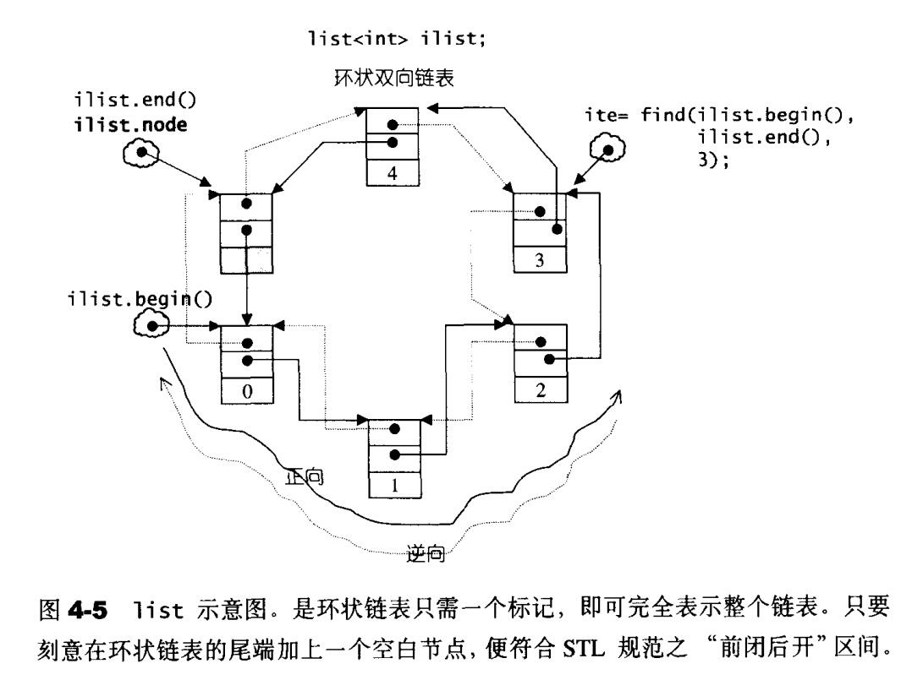

​		对于insert操作，在**插入完成后新结点会位于哨兵迭代器的前方**。且删除和插入新结点不会造成其他结点的空间重新配置，因此**迭代器不会失效**，除了被删的那个

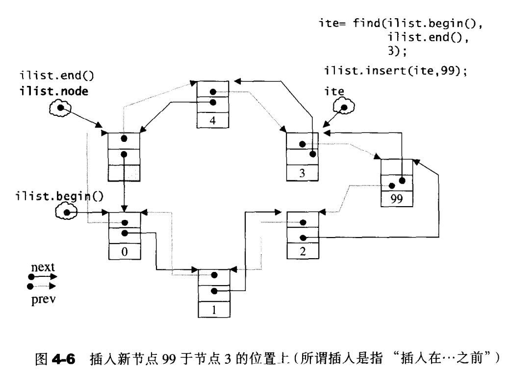

### 1.3deque

​		deque是一种双向开口的连续线性空间容器。所谓双向开口指的是**可以在头尾两端分别做元素的插入和删除**。vector也可以，但vector的头部操作效率奇差

​		deque与vector的最大差异一在于**deque允许于常数时间内对头端进行元素的插入或移除**；二在于deque没有容量观念，因为**deque是动态地以分段连续空间组合而成**，随时可以增加一段新的空间并链接起来

​		虽然deque也支持随机访问，但**它的迭代器不是普通指针，其复杂度相比于vector的要差**。因此**除非必要，应当尽可能选用vector而非deque**。对deque的排序操作，**为了最高效率，可以将deque先完整复制到一个vector上，对vector排序后再复制回deque**

​		deque系由一段一段的定量连续空间构成。**一旦有必要在deque的头端或尾端增加新空间，便配置一段定量连续空间，串接在deque的头端或尾端**。因此为了维持整体连续的假象，数据结构的设计和迭代器的前进后退都更为繁琐。

​		deque**采用一个map(不是STL map)连续空间作为主控**，其中每个元素称为结点node都是指针，**每个指针都指向一块较大的连续线性空间成为缓冲区**

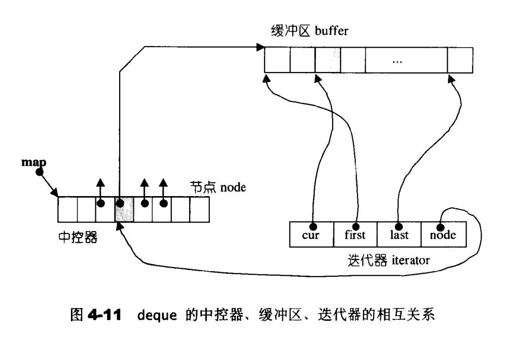

deque的迭代器**需要记录自己所指向的元素cur，所处缓冲区的头first尾last，所在的缓冲区node**。而在迭代器前进后退的时候**需要视情况跳跃到新的缓冲区**

### 1.4stack

stack最主要的特性是**后进先出FILO**。它只有一个出口，**只能对其顶端元素进行操作**，且stack不允许遍历行为，也**不提供迭代器**。

stack的底层结构**可采用deque实现**，可以封闭头端，只允许对尾端进行插入、删除操作即可实现

也**可采用list实现**，可以封闭链表头部，只允许对链表尾部进行插入、删除操作

### 1.5queue

queue最主要的特性是**先进先出FIFO**。**它只允许在底端插入元素，只允许在头端取出元素**，且queue不允许遍历行为，也**不提供迭代器**

queue的底层结构**可采用deque实现**，可以只允许在尾端插入，只允许在头端取出

也**可采用list实现**，只允许在链表尾部插入，只允许在链表头部取出

### 1.6堆 heap

二叉堆是一种完全二叉树，也就是说整棵二叉树除了最底层的也结点外都是填满的

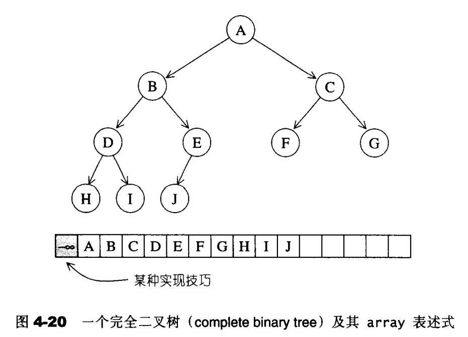

完全二叉树带来了一个好处，**可以使用数组来存储整棵树**。这里有一个小技巧，如果将0元素保留，那么**当某个结点的下标为i时，它的左子结点一定位于2i处，它的右子结点一定位于2i+1处，它的父节点一定位于i/2处**

#### push操作

为了满足完全二叉树的条件，新加入的元素一定要放在最下一层作为页结点，也就是数组中的尾部。然后开始执行一个上溯程序，将新结点拿来与其父节点做比较，**如果key比父节点大，则父子对换位置，直到不需要对换或直到根结点为止**。

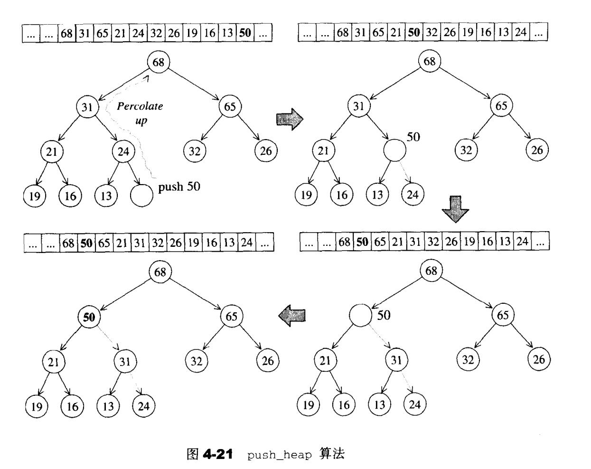

#### pop操作

为了满足max-heap的条件，在取出结点后需要执行一个下溯程序。**将尾部那个结点填入顶部，然后拿它来和两个子结点比较key，与其中较大的子结点对换位置，如此一直下放直到key大于两个子结点或直到叶节点为止**

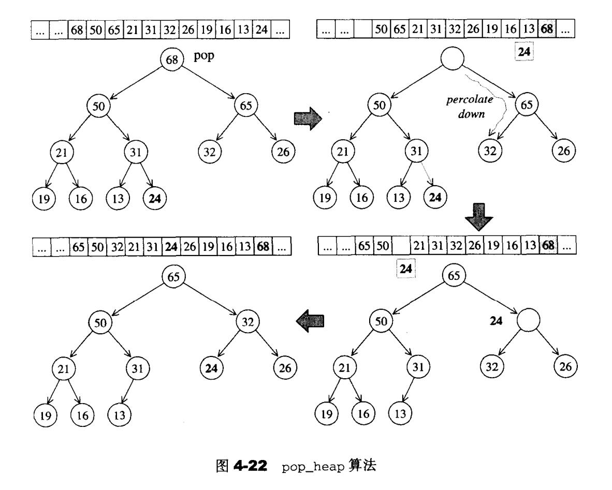

### 1.7priority_queue

顾名思义，也就是一个**拥有权值观念的queue**。它只允许加入新元素，移除旧元素，查看元素值等功能

**priority_queue中的元素并非按照被推入的次序排列，而是自动依照元素的权值排列，权值高者排在前面**

由于priority_queue完全以底部容器为根据，再加上heap处理规则，所以其实现非常简单。**默认情况以vector作为底部容器**

priority_queue中的所有元素进出都有一定的规则，**只有顶部具有最高权值的元素才有机会被取用**。

priority_queue**不提供遍历功能，不提供迭代器**

## 2.关联式容器

关联式容器主要分为map和set两大类

### 2.1 AVL树

AVL树是一个”加上了额外平衡条件的“二叉搜索树。其平衡条件的建立是**为了确保整棵树的深度为O(logN)**。

**AVL树要求任何节点的左右子树高度相差最多1**。这是一个较弱的条件，但仍能够保证对数深度平衡状态

在向AVL数插入结点后如果违反了AVL树的平衡条件。由于只有"插入点至根结点"路径上的各节点可能改变平衡状态。因此**只需要调整其中最深的那个结点X便可使整棵树恢复平衡**

可以将平衡被破坏的情况分为四种：

- 插入点位于X的左子节点的左子树——**左左**
- 插入点位于X的左子节点的右子树——**左右**
- 插入点位于X的右子节点的左子树——**右左**
- 插入点位于X的右子节点的右子树——**右右**

情况1、4彼此对称，称为**外侧插入，可以采用单旋转操作解决**

情况2、3彼此对称，成为**内侧插入，可以采用双旋转操作解决**

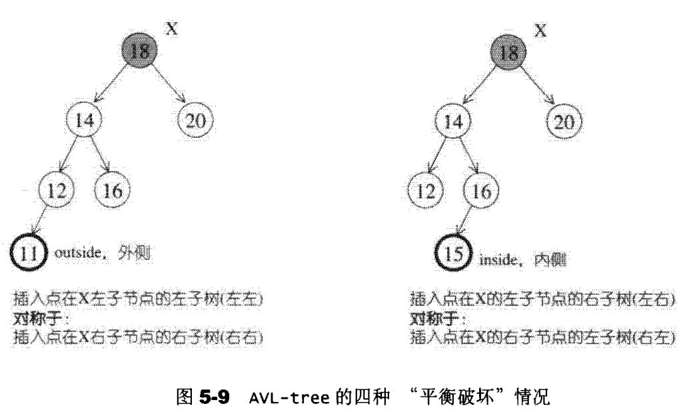

#### 单旋转

用于外侧插入的情况。如果是左左情况，则调整k2结点及其左子结点k1；右右情况调整k2结点及其右子结点k1

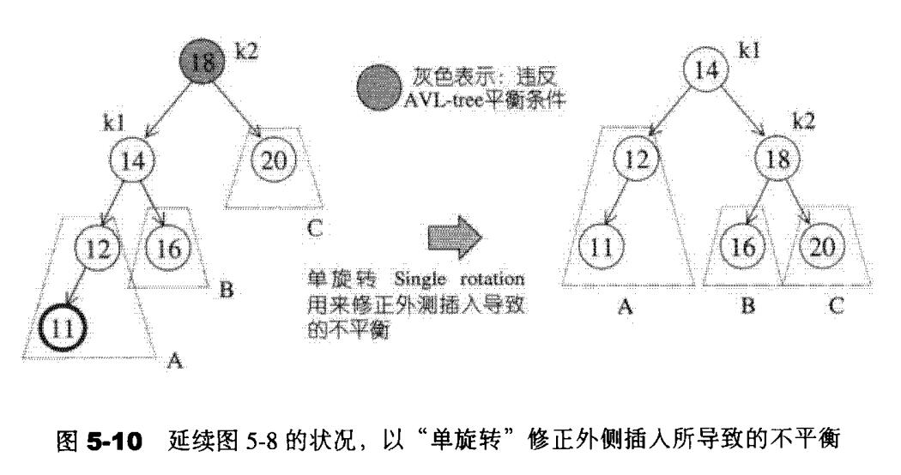

可以这么想象：将左子结点k1提起，k2结点自然下落成为k1结点新的右子结点，原来的k1的右子树根据二叉搜索树的规则它一定大于k1且小于k1，所以把这个子树作为k2左子树即可。

右右的情况类似

#### 双旋转

用于内侧插入的情况。

如果是左右情况，则第一步先调整k3的左子结点k1，和k1的右子结点k2，做一次单旋转。第二步，对旋转上来的k2结点和最上面的结点k3做一次单旋转，完成

如果是右左情况，则第一步先调整k3的右子结点k1，和k1的左子结点k2，做一次单旋转。第二步，对旋转上来的k2结点和最上面的结点k3做一次单旋转，完成

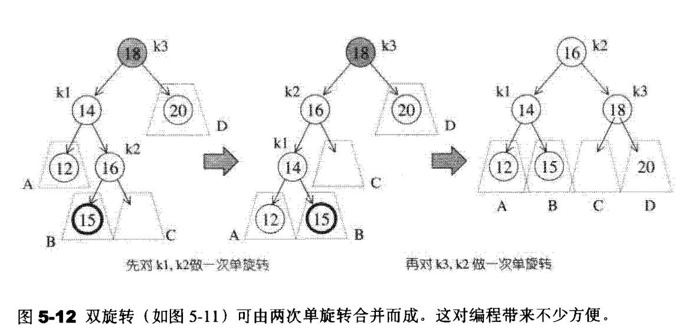

### 2.2红黑树 R-B Tree

红黑树是二叉搜索树，有以下四条规则

1. 每一个结点都是黑色或者红色
2. 根结点为黑色
3. 如果一个结点是红色的，那么它的子结点必须为黑色
4. 从一个结点到每一个null指针的路径上都必须包含相同数量的黑色结点

第4条规则决定了**在插入结点时只能插入红色结点，否则会导致黑色结点数量不一致**

如果插入红色结点之后违反规则3，那就需要通过旋转和颜色的改变来更正，使树符合规则

**红黑树在最差情况下插入删除时间复杂度都是O(logn)**

### 2.3set

set基于红黑树实现

set的特性是，**所有元素都会根据元素的键值自动被排序**。set不允许两个元素有相同键值

set的迭代器不允许写入操作，也就是**不能通过set的迭代器改变set的元素值**

**set在insert或erase之后迭代器不会失效**，除了被删除的那个元素的迭代器

### 2.4map

map基于红黑树实现

map的特性是，**所有元素都会根据元素的key自动被排序**

map的所有元素都是pair，同时拥有key和value。且不允许两个元素有相同的key

**map不能通过迭代器修改元素的key，但可以修改元素的value**。因为value不参与红黑树结构的组织

**map在insert或erase之后迭代器不会失效**，除了被删除的那个元素的迭代器

### 2.5multiset, multimap

这两个STL特性及其用法与SET,MAP完全相同。唯一区别在于它们**允许key重复**

### 2.6哈希表 hashtable

​		为了避免使用一个大的荒谬的array，应当使用某种映射函数**将一个key映射为一个”大小可接受之索引“**，这样的函数就成为**hash function（哈希函数）**

​		使用哈希函数会带来一个问题：可能会有不同的元素被映射到相同的位置（也就是有相同的索引），这便是**碰撞问题**

#### 线性探测

​		**负载系数（loading factor）**：指元素个数除以表格大小，**负载系数永远在0~1之间，除非采取开链策略**

​		当发生哈希碰撞时，最简单的方法就是**按照顺序往下寻找（如果到达尾端就绕到头部继续寻找），直到找到一个可用的空位**。只要表格（即array）足够大，就一定能找到一个安身立命的空间，但是要花多少时间就很难说了。

​		进行元素查找操作时，道理也一样，如果哈希函数计算出的位置上的元素和目标不符合，那就**按照顺序往下寻找，直到碰到吻合者，或者遇上空格元素**。

​		**在元素删除时必须采用惰性删除，也就是只把元素标记为已删除**，不把它清空。实际的删除操作要等到表格重新整理时再进行。这是由于**哈希表中每个元素不仅表述它自己，也关系到其他元素的排列**

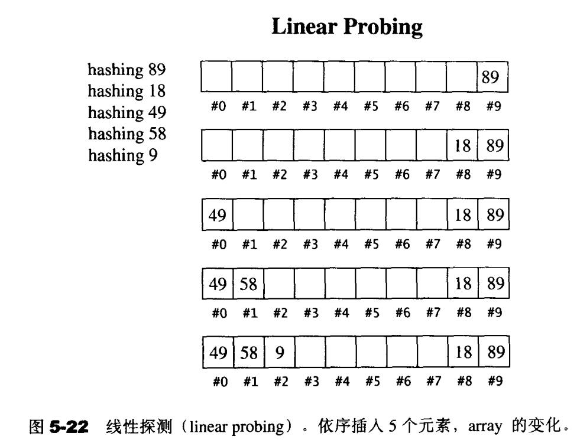

​		假设1）表格足够大 2）每个元素都够独立。在这一假设下，**最坏的情况是线性巡访整个表格，平均情况是巡访一半表格**。这与常数时间差别太远，且实际情况更糟糕

​		也就是多个元素在被插入之后形成了**主集团**，被哈希到这个主集团范围内的新插入元素都要巡访一段才能找到插入位置，使得**平均插入成本的增长幅度远高于负载系数的成长幅度**

​		**此时我们手上有的是一大团已被用过的方格，插入操作极有可能在主集团所形成的的泥泞中奋力爬行，不断解决碰撞问题，最后才射门得分，但是却又助长了主集团的泥泞面积**

#### 二次探测

​		二次探测**主要用于解决主集团的问题**。其命名来源是因为解决哈希碰撞的方程式 **F(i)=i^2** 是个二次方程式。明确的说，如果哈希函数计算出新元素的位置为H，而该位置实际上已经被使用，那么就依次尝试H+1^2，H+2^2，H+3^2....。

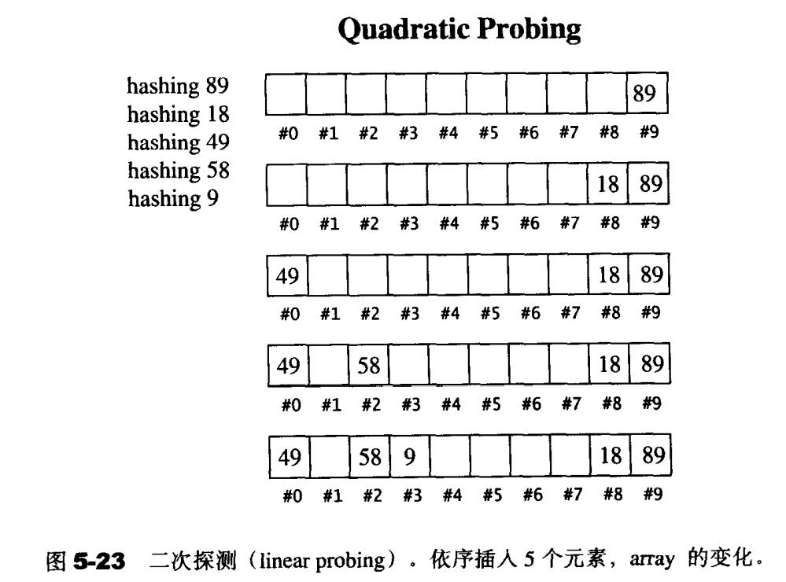

​		幸运的是，如果我们假设**表格大小为质数，且永远保持负载系数在0.5以下**（也就是说超过0.5就重新配置并整理表格），那么久可以确定每插入一个新元素所需要的探测次数不多于2（这里好像涉及数学推导，就不懂了）

​		欲扩充表格，首先**必须找出下一个新的且够大（大约2倍）的质数**，然后必须考虑表格重建（rehashing）的成本——是的不能只是原封不动的拷贝，**必须检验旧表格中的每一个元素，计算其在新表格中的位置，然后再插入到新表格中**

​		二次探测**可以消除主集团，却可能造成次集团**：**两个元素经过哈希函数计算出来的位置如果相同，则插入时探测的位置也相同，形成某种浪费**。复式哈希（double hashing）可以解决这一问题

#### 开链

​		另一种与二次探测法分庭抗礼的是**开链**（separate chaining）法。

​		这种做法是在每一个表格元素中维护一个list，**哈希函数将元素分配到一个list，然后在那个list上执行元素的插入、搜寻、删除等操作**。虽然对list进行的搜寻只能是一种线性操作，但**如果list够短，速度还是够快**

### 2.7unorsered_set，unorsered_map

这两个容器都是基于哈希表实现，使用开链法处理哈希碰撞问题。插入，查找，删除都是常数时间复杂度。

运用set，为的是能够快速搜寻元素。运用map，是为了能够快速搜寻key及其value。

但是**红黑树实现的set和map有自动排序功能，而哈希表实现的unordered_set和unordered_map没有**。

unordered_set中只有key，这点与set相同。unordered_map中有key和value，这点和map相同。

unordered_set，unordered_map的用法与set，map一致

### 2.8unorsered_multiset, unorsered_multimap

这两个STL特性及其用法与unordered_set,unordered_map完全相同。唯一区别在于它们**允许key重复**

同样使用哈希表实现，key没有自动排序功能

