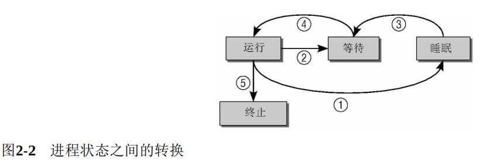
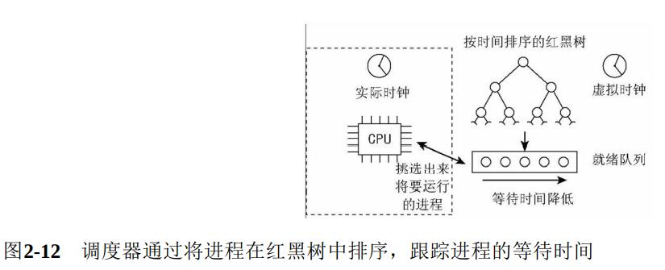
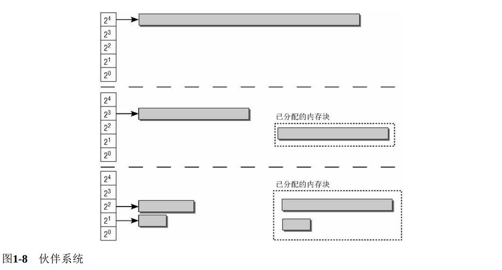
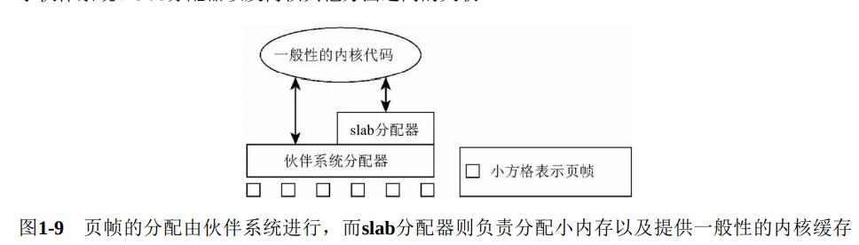
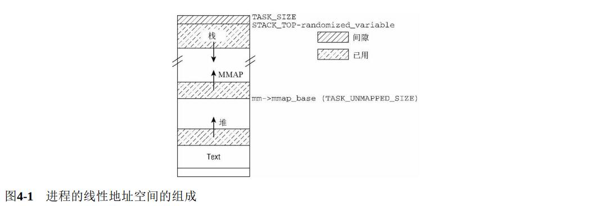
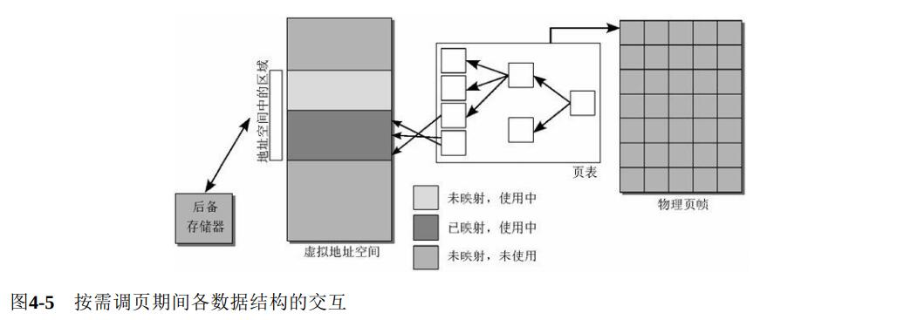

# Linux Kernel

《深入Linux内核架构》部分章节阅读笔记

## 2 进程管理和调度

​		所有的现代操作系统都能够同时运行若干进程。在多处理器系统中，可以真正并行运行的进程数目，取决于物理CPU的数目。

​		内核和处理器建立了多任务的错觉，即可以并行做几种操作，这是**通过以很短的间隔在系统运行的应用程序之间不停切换而做到的**

对于这种系统管理方式有两个问题内核必须解决：

- 除非明确地要求，否则应用程序不能彼此干扰
- CPU时间必须在各种应用程序之间尽可能公平地共享，其中一些程序可能比其他程序更重要

### 2.2 进程生命周期

进程可能有以下几种状态：

- 运行：该进程此刻**正在执行**。
- 等待：进程**能够运行，但没有得到许可**，因为CPU分配给另一个进程。调度器可以在下一次任务切换时选择该进程。
- 睡眠：进程**正在睡眠无法运行**，因为它在等待一个外部事件。调度器无法在下一次任务切换时选择该进程。

① 如果进程必须**等待事件**，则其状态从**“运行”**改变为**“睡眠”**

② 在调度器决定从该进程收回CPU资源时，过程状态从**“运行”**改变为**“等待”**

③ **进程状态无法从“睡眠”直接改变为“运行”**。在所等待的事件发生后，进程先变回到“等待”状态。

④ 在调度器授予CPU时间之前，进程会一直保持等待状态。在分配CPU时间之后，其状态改变为“运行”

⑤ 在程序执行终止（例如，用户关闭应用程序）后，过程状态由“运行”变为“终止”

#### 僵尸进程

​		存在一个特殊的进程状态是所谓的“僵尸”状态。说这些进程死了，是因为**其资源（内存、与外设的连接，等等）已经释放**，因此它们无法也决不会再次运行。说它们仍然活着，是因为**进程表中仍然有对应的表项**。

“僵尸”状态进程的产生原因在于UNIX操作系统下进程创建和销毁的方式：

- 程序必须由另一个进程或一个用户杀死（通常是通过发送SIGTERM或SIGKILL信号来完成，这等价于正常地终止进程）
- 进程的**父进程在子进程终止时必须调用或已经调用wait4**（读做wait for）系统调用。 这相当于**向内核证实父进程已经确认子进程的终结**。

只有在第一个条件发生（程序终止）而第二个条件不成立的情况下（wait4），才会出现“僵尸”状态

#### 抢占式任务调度

​		Linux进程管理的结构中还需要另外两种进程状态选项：**用户态和核心态**

​		进程通常都处于用户状态，只能访问自身的数据，无法干扰系统中的其他应用程序，甚至也不会注意到自身之外其他程序的存在。

​		如果进程想要访问系统数据或功能（后者管理着所有进程之间共享的资源，例如文件系统空间），则必须切 换到核心态。显然**这只能在受控情况下完成**。第一种状态切换的方法就是系统调用。

​		第二种切换用户态到核心态的方法是中断，此时切换是自动触发的。系统调用是由用户应用程序有意调用的，**中断则不同，其发生或多或少是不可预测的**。**处理中断的操作，通常与中断发生时执行的进程无关**。例如，外部块设备向内存传输数据完毕会引发一个中断。**在Linux执行中断操作时，当前运行的进程不会察觉**

内核的抢占调度模型建立了一个层次结构，用于判断哪些进程状态可以由其他状态抢占：

- **普通进程总是可能被抢占，甚至是由其他进程抢占**。在一个重要进程变为可运行时，例如编辑器接收到 了等待已久的键盘输入，调度器可以决定是否立即执行该进程，即使当前有其他进程在正常运行
- 如果系统处于核心态并正在处理系统调用，那么系统中的其他进程是无法夺取其CPU时间的。**调度器必须等到系统调用执行结束，才能选择另一个进程执行，但中断可以中止系统调用**。
- 中断可以暂停处于用户状态和核心态的进程。**中断具有最高优先级，因为在中断触发后需要尽快处理**。

### 2.3 进程表示

#### 2.3.1 进程类型

新进程是使用fork和exec系统调用产生的。

- **fork生成当前进程的一个相同副本，该副本称之为子进程**。原进程的所有资源都以适当的方式复制到子进程，因此该系统调用之后，**原来的进程就有了两个独立的实例**。这两个实例的联系包括：同一组打开文件、同样的工作目录、内存中同样的数据（两个进程各有一份副本），等等。
- exec从一个可执行的二进制文件加载另一个应用程序，来代替当前运行的进程。换句话说，**加载了一 个新程序**。因为exec并不创建新进程，所以**必须首先使用fork复制一个旧的程序，然后调用exec在系统上创建另一个应用程序**。

除此之外Linux还提供了**clone系统调用**。clone的工作原理基本上与fork相同，但新进程不是独立于父进程的，而可以与其共享某些资源。**可以指定需要共享和复制的资源种类**，例如，父进程的内存数据、打开文件或安装的信号处理程序。

**clone用于实现线程**。线程库的例子，有Linuxthreads和Next Generation Posix Threads等

#### 2.3.3 进程ID号

##### 1.  进程ID

UNIX进程总是会分配一个号码用于在其命名空间中唯一地标识它们。**该号码被称作进程ID号，简称PID**。 用fork或clone产生的每个进程**都由内核自动地分配了一个新的唯一的PID值**。

每个进程除了PID这个特征值之外，还有其他的ID：

- **处于某个线程组中的所有进程都有统一的线程组ID（TGID）**。如果进程没有使用线程，则其PID和TGID相同。线程组中的主进程被称作组长（group leader）。
- 另外，独立进程可以合并成进程组（使用setpgrp系统调用）。**进程组简化了向组的所有成员发送信号的操作**
- 几个进程组可以合并成一个会话。会话中的所有进程都有同样的会话ID。

##### 3 生成唯一的PID    

​		除了管理PID之外，内核还负责提供机制来生成唯一的PID（尚未分配）

​		为跟踪已经分配和仍然可用的PID，内核使用一个大的位图，其中每个PID由一个比特标识。PID的值可通过 对应比特在位图中的位置计算而来。

​		因此，分配一个空闲的PID，本质上就等同于**寻找位图中第一个值为0的比特，接下来将该比特设置为1**。反 之，**释放一个PID可通过将对应的比特从1切换为0来实现**。

### 2.4 进程管理相关的系统调用

#### 2.4.1 进程复制

Linux实现了3个复制进程的系统调用：

1. fork是**重量级调用**，因为**它建立了父进程的一个完整副本，然后作为子进程执行**。为减少与该调用相关的工作量，Linux使用了**写时复制（copy-on-write）**技术
2. vfork类似于fork，但**并不创建父进程数据的副本**。相反，父子进程之间共享数据。**vfork设计用于子进程形成后立即执行execve系统调用加载新程序的情形**。在子进程退出或开始新程序之前，内核保证父进程处于堵塞状态。由于fork使用了写时复制技术， vfork速度方面不再有优势，因此**应该避免使用它**。
3. clone产生线程，**可以对父子进程之间的共享、复制进行精确控制**

**写时复制**

​		内核使用了**写时复制（Copy-On-Write，COW）技术**，以防止在fork执行时将父进程的所有数据复制到子进程。该技术利用了下述事实：**进程通常只使用了其内存页的一小部分**。

完整复制父进程的每一个内存页会带来两个问题：

- 使用了大量内存。
- 复制操作耗费很长时间。

​        如果应用程序在进程复制之后使用exec立即加载新程序，那么负面效应会更严重。

​		内核可以使用技巧规避该问题。并不复制进程的整个地址空间，而是**只复制其页表**。因此，fork之后父子进程的地址空间指向同样的物理内存页。当然，**父子进程不能允许修改彼此的页**

​		如果页表项将一页标记为“只读”，但通常情况下该页应该是可写的，内核可根据此条件来判断该页实际上是COW页。**因此内核会创建该页专用于当前进程的副本，当然也可以用于写操作**。

​		COW机制**使得内核可以尽可能延迟内存页的复制**，更重要的是，**在很多情况下不需要复制。这节省了大量时间**。

#### 2.4.3 启动新程序

通过**用新代码替换现存程序，即可启动新程序**。Linux提供的execve系统调用可用于该目的

- 释放原进程使用的所有资源。
- 将应用程序映射到虚拟地址空间中。
- 设置进程的指令指针和其他特定于体系结构的寄存器，以便在调度器选择该进程时开始执行程序的 main函数。

#### 2.4.4 退出进程

​		**进程必须用exit系统调用终止**。这使得内核有机会将该进程使用的资源释放回系统。

​		程序员可以显式调用exit。但编译器会在main函数（或特定语言使用的main函数）末尾自动添加相应的调用。

​		简而言之，该函数的实现就是将各个引用计数器减1，如果引用计数器归0而没有进程再使用对应的结构，那 么将相应的内存区域返还给内存管理模块。

### 2.5 调度器的实现

​		内存中保存了对每个进程的唯一描述，并通过若干结构与其他进程连接起来。调度器面对的情形就是这样， 其任务是**在程序之间共享CPU时间，创造并行执行的错觉**。

#### 2.5.1 概观

​		内核必须提供一种方法，**在各个进程之间尽可能公平地共享CPU时间**，而同时又要考虑不同的任务优先级。

​		Linux调度器的一个杰出特性是，它不需要时间片概念，至少不需要传统的时间片。**当前的调度器只考虑进程的等待时间**，**即进程在就绪队列（run-queue）中已经等待了多长时间**。对CPU时间需求最严格的进程被调度执行。

​		调度器的一般原理是，**按所能分配的计算能力，向系统中的每个进程提供最大的公正性**。或者从另一个角度来说，**它试图确保没有进程被亏待**。

​		**每次调用调度器时，它会挑选具有最高等待时间的进程，把CPU提供给该进程**。如果经常发生这种情况，那么进程的不公平待遇不会累积，**不公平会均匀分布到系统中的所有进程**。

​		**所有的可运行进程都按时间在一个红黑树中排序，所谓时间即其等待时间**。等待CPU时间最长的进程是最左侧的项，调度器下一次会考虑该进程。等待时间稍短的进程在该树上从左至右排序

遗憾的是，该策略受若干现实问题的影响，已经变得复杂了。

- 进程的不同优先级（即，nice值）必须考虑，**更重要的进程必须比次要进程更多的CPU时间份额**。
- **进程不能切换得太频繁**，因为上下文切换，即从一个进程改变到另一个，是有一定开销的。在切换发生得太频繁时，过多时间花费在进程切换的过程中，而不是用于实际的工作。

#### 2.5.3 处理优先级

##### **1 优先级的内核表示**

​	在用户空间**可以通过nice命令设置进程的静态优先级**。进程的nice值在-20和+19之间（包含）。**值越低，表明优先级越高**。

​		内核使用一个简单些的数值范围，从0到139（包含），用来表示内部优先级。**同样是值越低，优先级越高**。 **从0到99的范围专供实时进程使用**。nice值[-20, +19]映射到范围100到139，如图2-14所示。**实时进程的优先级总是比普通进程更高**。

##### 3 计算负荷权重

​		进程的重要性不仅是由优先级指定的，而且还需要考虑保存在task_struct->se.load的负荷权重

​		一般概念是这样，**进程每降低一个nice值，则多获得10%的CPU时间，每升高一个nice值，则放弃10%的 CPU时间**。为执行该策略，内核将优先级转换为权重值

#### 2.5.4 核心调度器

​		调度器的实现基于两个函数：**周期性调度器函数和主调度器函数**。**这些函数根据现有进程的优先级分配CPU时间**。这也是为什么整个方法称之为优先调度的原因

##### 1 周期性调度器

周期性调度器在scheduler_tick中实现。如果系统正在活动中，内核会按照频率HZ自动调用该函数

- 管理内核中与整个系统和各个进程的调度相关的统计量。其间执行的主要操作是对各种计数器加1，我们 对此没什么兴趣。
- 激活负责当前进程的调度类的周期性调度方法

##### 2 主调度器

在内核中的许多地方，如果要将CPU分配给与当前活动进程不同的另一个进程，都会直接调用主调度器函数

##### 4 上下文切换

内核选择新进程之后，必须处理与多任务相关的技术细节。这些细节总称为**上下文切换（context switching）**

### 2.7 实时调度类

按照POSIX标准的强制要求，除了“普通”进程之外，Linux还支持两种实时调度类。

#### 2.7.1 性质

​		实时进程与普通进程有一个根本的不同之处：如果系统中有一个实时进程且可运行，那么调度器总是会选中 它运行，除非有另一个优先级更高的实时进程。

现有的两种实时类：

- **循环进程（SCHED_RR）**有时间片，其值在进程运行时会减少，就像是普通进程。在所有的时间段都到期后，则该值重置为初始值，而进程则置于队列的末尾。这确保了在有几个优先级相同的SCHED_RR进 程的情况下，它们总是依次执行。**即轮转算法**
- **先进先出进程（SCHED_FIFO）**没有时间片，在被调度器选择执行后，**可以运行任意长时间**。

如果实时进程编写得比较差，系统可能变得无法使用。只要写一个无限循环，循环体内不进入睡眠即可

## 3 内存管理

### 3.3 页表

​		层次化的页表用于支持对大地址空间的快速、高效的管理。

​		**页表用于建立用户进程的虚拟地址空间和系统物理内存（内存、页帧）之间的关联**。页表用于向每个进程提供一致的虚拟地址空间。**应用程序看到的地址空间是一个连续的内存区**。该表也将虚拟内存页映射到物理内存，因而支持共享内存的实现。还可以在不额外增加物理内存的情况下，**将页换出到块设备来增加有效的可用内存空间**。

​		内核内存管理**总是假定使用四级页表**，而不管底层处理器是否如此。

#### 3.3.1 数据结构

##### 1 内存地址的分解

根据四级页表结构的需要，**虚拟内存地址分为5部分（4个表项用于选择页，1个索引表示页内位置）**。

### 3.5 物理内存的管理

#### 3.5.1 伙伴系统

​		内核中很多时候要求分配连续页。为**快速检测内存中的连续区域**，内核采用了伙伴系统。

​		**系统中的空闲内存块总是两两分组，每组中的两个内存块称作伙伴**。伙伴的分配可以是彼此独立的。但**如果两个伙伴都是空闲的，内核会将其合并为一个更大的内存块，作为下一层次上某个内存块的伙伴**

​		在应用程序释放内存时，内核可以直接检查地址，来判断是否能够创建一组伙伴，并合并为一个更大的内存块放回到伙伴列表中，这刚好是内存块分裂的逆过程。这提高了较大内存块可用的可能性。

#### 3.5.2 避免碎片

内核的方法是**反碎片（anti-fragmentation）**，即**试图从最初开始尽可能防止碎片**

内核将已分配页划分为下面3种不同类型：

- **不可移动页**：在内存中有固定位置，不能移动到其他地方。**核心内核分配的大多数内存属于该类别**。
- **可回收页**：不能直接移动，但可以删除，其内容可以从某些源重新生成。
- **可移动页**：可以随意地移动。**属于用户空间应用程序的页属于该类别**。它们是通过页表映射的。如果它们复制到新位置，页表项可以相应地更新，应用程序不会注意到任何事。

内核使用的反碎片技术，即基于**将具有相同可移动性的页分组的思想**

### 3.6 slab缓存

​		内核本身**经常需要比完整页帧小得多的内存块**。由于内核无法使用标准库的函数，因而**必须在伙伴系统基础上自行定义额外的内存管理层，将伙伴系统提供的页划分为更小的部分**

它可以用两种方法分配内存：

- 对频繁使用的对象，内核定义了只包含了所需类型对象实例的缓存。每次需要某种对象时，可以**从对应的缓存快速分配（使用后释放到缓存）**。**slab缓存自动维护与伙伴系统的交互，在缓存用尽时会请求新的页帧**。
- 对通常情况下小内存块的分配，内核针对不同大小的对象定义了一组slab缓存，可以像用户空间编程一样，用相同的函数访问这些缓存。不同之处是这些函数都增加了前缀k，表明是与内核相关联 的：kmalloc和kfree。

## 4 进程虚拟内存

用户层进程的虚拟地址空间是Linux的一个重要抽象：**它向每个运行进程提供了同样的系统视图，这使得多个进程可以同时运行，而不会干扰到其他进程内存中的内容。**

### 4.1 简介

虚拟内存管理的一些点：

- **每个应用程序都有自身的地址空间**，与所有其他应用程序分隔开
- 通常在巨大的线性地址空间中，**只有很少的段可用于各个用户空间进程**，这些段彼此有一定的距离。内核需要一些数据结构，来有效地管理这些（随机）分布的段。
- 地址空间**只有极小的一部分与物理内存页直接关联。不经常使用的部分，则仅当必要时与页帧关联**。
- 内核信任自身，但无法信任用户进程。因此，**各个操作用户地址空间的操作都伴随有各种检查，以确保程序的权限不会超出应有的限制**，进而危及系统的稳定性和安全性。

### 4.2 进程虚拟地址空间

​		各个进程的虚拟地址空间起始于地址0，延伸到TASK_SIZE - 1，其上是内核地址空间。

​		**用户程序只能访问整个地址空间的下半部分，不能访问内核部分**。如果没有预先达成“协议”，用户进程也不可能操作另一个进程的地址空间，因为**后者的地址空间对前者不可见**。

### 4.3 内存映射的原理

​		由于所有用户进程总的虚拟地址空间比可用的物理内存大得多，因此只有最常用的部分才与物理页帧关联。 这不是问题，因为**大多数程序只占用实际可用内存的一小部分**。

​		内核必须提供数据结构，以**建立虚拟地址空间的区域和相关数据所在位置之间的关联**。

按需分配和填充页称之为**按需调页法**（demand paging）

缺页异常：

- 进程试图访问用户地址空间中的一个内存地址，但**使用页表无法确定物理地址（物理内存中没有关联页）**。
- 处理器接下来**触发一个缺页异常，发送到内核**。
- 内核会检查负责缺页区域的进程地址空间数据结构，找到适当的后备存储器，或者确认该访问实际上是 不正确的。
- **分配物理内存页**，并从后备存储器读取所需数据填充。
- **借助于页表将物理内存页并入到用户进程的地址空间**，应用程序恢复执行。

文件的内存映射可以认为是**两个不同的地址空间之间的映射**，以简化（系统）程序员的工作。一个地址空间是**用户进程的虚拟地址空间**，另一个是**文件系统所在的地址空间**。

## 8 虚拟文件系统

​		为支持各种本机文件系统，且在同时允许访问其他操作系统的文件，Linux内核在用户进程（或C标准库）和文件系统实现之间引入了一个抽象层。该抽象层称之为**虚拟文件系统（Virtual File System）**，简称VFS。

​		VFS的任务并不简单。一方面，它用来**提供一种操作文件、目录及其他对象的统一方法**。另一方面，它**必须能够与各种方法给出的具体文件系统的实现达成妥协**

### 8.2 通用文件模型

​		VFS不仅为文件系统提供了方法和抽象，还支持文件系统中对象（或文件）的统一视图。

​		定义一个最小的通用模型，来支持内核中所有文件系统都实现的那些功能，这是不实际的。VFS的方案完全相反：**提供一种结构模型，包含了一个强大文件系统所应具备的所有组件**。但**该模型只存在于虚拟中，必须使用各种对象和函数指针与每种文件系统适配**。所有文件系统的实现都必须提供与VFS定义的结构配合的例程，以弥合两种视图之间的差异。

在处理文件时，内核空间和用户空间使用的主要对象是不同的：

- **对用户程序来说，一个文件由一个文件描述符标识**。该描述符是一个整数，在所有有关文件的操作中用作标识文件的参数。**文件描述符是在打开文件时由内核分配，只在一个进程内部有效**。**两个不同进程可以使用同样的文件描述符，但二者并不指向同一个文件**。基于同一个描述符来共享文件是不可能的。
- **内核处理文件的关键是inode**。**每个文件（和目录）都有且只有一个对应的indoe**，其中包含元数据（如访问权限、上次修改的日期，等等）和指向文件数据的指针。但inode并不包含一个重要的信息项，即文件名

#### 8.2.1 inode

inode对文件实现来说是一个主要的概念，但它**也用于实现目录**。换句话说，**目录只是一种特殊的文件**

inode成员分为两类：

- 描述文件状态的元数据。例如，访问权限或上次修改的日期。
- 保存实际文件内容的数据段（或指向数据的指针，例如符号链接）

​		查找起始于inode，它表示根目录/，对系统来说必须总是已知的。**该目录由一个inode表示，其数据段并不包 含普通数据，而是根目录下的各个目录项**。这些项可能代表文件或其他目录。每个项由两个成员组成：

- 该目录项的数据所在inode的编号。
- 文件或目录的名称

**系统中所有inode都有一个特定的编号，用于唯一地标识各个inode**。文件名和inode之间的关联即通过该编号建立。

#### 8.2.2 链接

链接（link）用于建立文件系统对象之间的联系。有两种类型的链接：

- 符号连接可以认为是“**方向指针**”，**表示某个文件存在于特定的位置**。**有时使用软链接来表示此类链接**。这是因为链接和链接目标彼此并未紧密耦合。链接可以认为是一个目录项，其中除了指向文件名的指针，并不存在其他数据。**目标文件删除时，符号链接仍然继续保持**。**对每个符号链接都使用了一个独立的inode。相应inode的数据段包含一个字符串，给出了链接目标的路径**。
- 在硬链接已经建立后，无法区分哪个文件是原来的，哪个是后来建立的。**在硬链接建立时，创建的目录项使用了一个现存的inode编号**。在inode中加入一个计数器，即可实现硬链接的删除。**每次对文件创建一个硬链接时，都将计数器加1**。如果其中 一个硬链接或原始文件被删除（不可能区分这两种情况），那么将计数器减1。 **只有在计数器归0时，我们才能确认该inode不再使用，可以从系统删除**。

#### 8.2.4 将文件作为通用接口

UNIX是基于少量审慎选择的范型而建立的。一个非常重要的隐喻贯穿内核的始终（特别是VFS），尤其是 在有关输入和输出机制的实现方面：

**万物皆文件**

