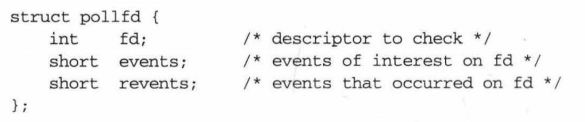

# 网络编程

参考书籍：Unix网络编程，Linux高性能服务器编程

## 1.基本TCP C-S程序套接字编程流程

## 2. I/O复用

### 2.1 I/O模型

#### 2.1.1 阻塞式I/O模型

在图6-1中，进程调用 recvfrom, 其系统调用直到数据报到达且被复制到应用进程的缓冲区中或者发生错误才返回。

#### 2.1.2 非阻塞式 I/O 模型

进程把一个套接字设置成非阻塞是在通知内核： 所请求的l/O操作非得把本进程置于休眠状态才能完成时，不要把本进程置于休眠状态，**而是返回一个错误**。

前3次调用 recvfrom时没有数据可返回，因此内核转而立即返回 EWOULDBLOCK错误。第四次调用 recvfrom时已有 个数据报准备好，它被复制到应用进程缓冲区，千是recvfrom 成功返回，我们接着处理数据。

当1个应用进程像这样**对1个非阻塞描述符循环调用 recvfrom** 时，我们称之为**轮询 (polling)** 。应用进程待续轮询内核 ，以查看某个操作是否就绪，这么做往往**耗费大量CPU时间**

#### 2.1.3 I/O复用模型

我们阻塞于select调用，等待数据报套接字变为可读 select返回套接字可读这一条件 时，我们调用recvfrom把所读数据报复制到应用进程缓冲区。

使用 select的优势在于我们**可以等待多个描述符就绪**

#### 2.1.4 信号驱动式 I/O 模型

我们也可以用信号，**让内核在描述符就绪时发送SIGIO信号通知**我们 。定义一个信号处理函数，进程收到信号后就会调用信号处理函数进行I/O操作。这种模型的优势在于**等待数据报到达期间进程不被阻塞。主循环可以继续执行**

#### 2.1.5 异步 I/O 模型

异步I/O函数的工作机制：告知内核启动某个操作，并让内核在整个操作（包括将数据从内核复制到我们自己的缓冲区）完成后通知。

这种模型与前一节介绍的信号驱动模型主要区别在于**信号驱动式是由内核通知我们何时可以启动I/O操作**，而**异步模型是由内核通知我们操作何时完成**。

支持POSIX异步I/O模型的系统仍较罕见。

#### 2.1.6 五种I/O模型比较

- 同步I/O操作：导致请求进程阻塞，直到I/O操作完成
- 异步I/O操作：不导致请求进程阻塞。

根据上述定义，我们的前4种模型——阻塞式I/O模型、非阻塞式I/O模型、 I/O复用模型和信号驱动I/O模型都是同步I/O模型 ．因为**其中真正的I/O操作 recvfrorn 将阻塞进程**。**只有异步I/O模型与POSIX定义的异步I/O相匹配**

### 2.2 select函数

该函数**允许进程指示内核等待多个事件中的任何一个发生，并只在有一 或多个事件发生或经历一段指定的时间后才唤醒它**。

作为一个例子，我们可以调用 select， 告知内核仅在下列情况发生时才返回：

- 集合 {1, 4, 5} 中的**任何描述符准备好读**
- 集合 {2, 7} 中的**任何描述符准备好写**
- 集合 {l, 4} 中的**任何描述符有异常条件待处理**
- 已**经历了10.2秒**

也就是说，我们调用 select 告知内核对哪些描述符（就读、写或异常条件 ）感兴趣以及等待多长时间。我们感兴趣的描述符不局限于套接字 ，**任何描述符都可以使用 select来测试**

select描述符集数量可能存在上限。

### 2.3 poll函数

poll 提供的功能与select类似，不过在处理流设备时 ，它能够提供额外的信息。

第一个参数是指向一个结构数组第1个元素的指针 。每个数组元素都是pollfd结构， 用于指定测试某个给定描述符 fd的条件。

要测试的条件由 events员指定，函数在相应的revent成员中返回该描述符的状态。 （每个描述符都有两个变量， 一个为调用值，另一个为返回结果，从而避免使用值－结果参数。)

### 2.4 epoll函数

#### 2.4.1 内核事件表

epoll是Linux 特有的 I/O 复用函数，它在实现和使用上与 select poll 有很大差异。

epoll 使用一组函数来完成任务，而不是单个函数。

其次， epoll 把用户关心的文件描述符上的事件放在内核里的一个事件表中，从而无须像 select poll 那样每次调用都要重复传入文件描述符集或事件集。

但 epoll 需要使用一个额外的文件描述符，来唯一标识内核中的这个事件表。这个文件描述符使用如下 epoll_ create 函数来创建：

用于操作epoll内核事件表的函数：

#### 2.4.2 epoll_wait函数

epoll 系列系统调用的主要接口是 epoll_wait 函数。它**在一段超时时间内等待一组文件描述符上的事件**，其原型如下：

该函数成功时返回就绪的文件描述符的个数，失败时返回－1并设置 errno

epoll_wait 函数如果检测到事件，就将所有就绪的事件从内核事件表（由 epfd 参数指定）中复制到它的第二个参数 events 指向的数组中。**这个数组只用于输出 epoll_wait 检测到的就绪事件**，而不像 select poll 的数组参数那样既用于传入用户注册的事件，又用于输出内核检测到的就绪事件。这就极大地提高了应用程序索引就绪文件描述符的效率。

#### 2.4.3 LT和ET模式

epoll 对文件描述符的操作有两种模式： **LT (Level Trigger, 电平触发）**模式和 **ET (Edge  Trigger, 边沿触发）**模式。

 LT 模式是默认的工作模式，**这种模式下 epoll 相当于一个效率较高的 poll** 。

当往 epoll 内核事件表中注册一个文件描述符上的 EPOLLET 事件时， epoll 将以 ET 模式来操作该文件描述符。 **ET 模式是 epoll 的高效工作模式**。

**LT**：对于采用 LT 工作模式的文件描述符，**当 epoll_wait 检测到其上有事件发生并将此 事件通知应用程序后，应用程序可以不立即处理该事件**。这样，当应用程序下一次调用 epoll_wait 时， epoll_wait 还会再次向应用程序通告此事件，直到该事件被处理

**ET**：而对于采用 ET 工作模式的文件描述符，**当 epoll_wait 检测到其上有事件发生并将此事件通知应用程序后，应用程序必须立即处理该事件**，因为**后续的 epoll_wait 调用将不再向应用程序通知这一事件**。可见， **ET 模式在很大程度上降低了同一个 epoll 事件被重复触发的次数**， 因此效率要比 LT 模式高。

ET模式对用户态读写处理的逻辑容错提出了更高的要求、但因为没有反复通知、所以性能更高

**每个使用 ET 模式的文件描述符都应该是非阻塞的**。由于ET模式只有在读与不可读两个状态间发生变化时才会触发，因此由不可读进入可读状态触发之后就必须一次将缓冲区中的数据读完，然后等待下一次缓冲区收到数据发生状态变化触发。**如果使用阻塞式文件描述符，则在最后一次读取时会阻塞**。而使用非阻塞式的文件描述符直接读到让 errno 返回 EAGAIN 或客户端断开连接为止

#### 2.4.4 EPOLLONESHOT事件

对于注册了 EPOLLONESHOT 事件的文件描述符，**操作系统最多触发其上注册的一个可读、可写或者异常事件，且只触发一次**，除非我们使用 epoll_ctl 函数重置该文件描述符上注 册的 EPOLLONESHOT 事件。

这样，**当一个线程在处理某个 socket 时，其他线程是不可能有机会操作该 socket 的**。

但反过来思考，**注册了 EPOLLONESHOT 事件的 socket 一旦被某个线程处理完毕，该线程就应该立即重置这个 socket 上的 EPOLLONESHOT 事件**，以确保这个 socket 次可读时，其 EPOLLIN 事件能被触发，进而让其他工作线程有机会继续处理这一socket

#### 2.4.5 C10K问题

**问题描述**

随着互联网的普及，应用的用户群体几何倍增长，此时服务器性能问题就出现。最初的服务器是基于进程/线程模型。新到来一个TCP连接，就需要分配一个进程。假如有C10K，就需要创建1W个进程，可想而知单机是无法承受的。那么如何突破单机性能是高性能网络编程必须要面对的问题，进而这些局限和问题就统称为C10K问题。

设计不够良好的程序，其性能和连接数及机器性能的关系往往是非线性的。

**问题本质**

创建的进程线程多了，数据拷贝频繁（缓存I/O、内核将数据拷贝到用户进程空间、阻塞）， 进程/线程上下文切换消耗大， 导致操作系统崩溃，这就是C10K问题的本质。可见，解决C10K问题的关键就是**尽可能减少这些CPU等核心计算资源消耗，从而榨干单台服务器的性能**，突破C10K问题所描述的瓶颈

**解决方案**

- **每个进程/线程处理一个连接**

  这一思路最为直接。但是由于申请进程/线程会占用相当可观的系统资源，同时对于多进程/线程的管理会对系统造成压力，因此这种方案不具备良好的可扩展性。

  因此，这一思路在服务器资源还没有富裕到足够程度的时候，是不可行的。即便资源足够富裕，效率也不够高。总之，此思路技术实现会使得资源占用过多，可扩展性差

- **每个进程/线程同时处理多个连接（IO多路复用）**

  - 实现方式1：传统思路最简单的方法是循环挨个处理各个连接，每个连接对应一个 socket，当所有 socket 都有数据的时候，这种方法是可行的。但是当应用读取某个 socket 的文件数据不 ready 的时候，整个应用会阻塞在这里等待该文件句柄，即使别的文件句柄 ready，也无法往下处理。

    实现小结：直接循环处理多个连接。

    问题归纳：任一文件句柄的不成功会阻塞住整个应用。

    

  - 实现方式2：select要解决上面阻塞的问题，思路很简单，如果我**在读取文件句柄之前，先查下它的状态，ready 了就进行处理，不 ready 就不进行处理**，这不就解决了这个问题了嘛？于是有了 select 方案。用一个 fd_set 结构体来告诉内核同时监控多个文件句柄，当其中有文件句柄的状态发生指定变化（例如某句柄由不可用变为可用）或超时，则调用返回。之后应用可以使用 FD_ISSET 来逐个查看是哪个文件句柄的状态发生了变化。这样做，小规模的连接问题不大，但当连接数很多（文件句柄个数很多）的时候，逐个检查状态就很慢了。因此，select 往往存在管理的句柄上限（FD_SETSIZE）。同时，在使用上，因为只有一个字段记录关注和发生事件，每次调用之前要重新初始化 fd_set 结构体。

    实现小结：有连接请求抵达了再检查处理。
    问题归纳：**句柄上限+重复初始化+逐个排查所有文件句柄状态效率不高**。

    

  - 实现方式3：poll 主要解决 select 的前两个问题：**通过一个 pollfd 数组向内核传递需要关注的事件消除文件句柄上限**，同时使用不同字段分别标注关注事件和发生事件，来避免重复初始化。

    实现小结：设计新的数据结构提供使用效率。
    问题归纳：**逐个排查所有文件句柄状态效率不高**。

    

  - 实现方式4：epoll既然逐个排查所有文件句柄状态效率不高，很自然的，如果调用返回的时候**只给应用提供发生了状态变化（很可能是数据 ready）的文件句柄**，进行排查的效率不就高多了么。epoll 采用了这种设计，适用于大规模的应用场景。实验表明，当文件句柄数目超过 10 之后，epoll 性能将优于 select 和 poll；当文件句柄数目达到 10K 的时候，epoll 已经超过 select 和 poll 两个数量级。

    实现小结：只返回状态变化的文件句柄。
    问题归纳：**依赖特定平台（Linux）**。

    

### 2.5 三组I/O复用函数的比较

**事件集：**

这三组函数都通过某种结构体变来告诉内核监听哪些文件描述符上的哪些事件，并使用该结构体类型的参数来获取内核处理的结果。

select 的参数类型 **fd_set 没有将文件描述符和事件绑定**，它仅仅是 个文件描述符集合，因此 select 需要提供一个这种类型的参数来分别传入和输出可读、可写及异常等事件，另一方面**使得 select 不能处理更多类型的事件**，另 一方面由于内核对 fd_set 集合的在线修改，**应用程序下次调用 select 前不得不重置这 fd_ set 集合**。

poll 的参数类型 pollfd 则多少“聪明”点， **它把文件描述符和事件都定义其中**， 任何事件都被统一处理，从而使得编程接口简洁得多。并且**内核每次修改的是 pollfd 结构体 revents 成员，而 events 成员保持不变**，因此下次调用 poll 时应用程序无须重置 pollfd 类型的事件集参数

epoll 则采用 select poll 完全不同的方式来管理用户注册的事件。它在内核中维护一个事件表，并提供了一个独立的系统调用 epoll ctl 来控制往其中添加、删除、修改事件。这样，**每次 epoll_wait 调用都直接从该内核事件表中取得用户注册的事件，而无须反复从用户间读入这些事件。**

由于每次 select poll 调用都**返回整个用户注册的事件集合**（其中包括就绪的和未就绪的），所以应用程序索引就绪文件描述符的时间复杂度为**O (n)**

epoll_wait 系统调用的 events 参数**仅用来返回就绪的事件**，这使得应用程序索引就绪文 件描述符的时间复杂度达到 **O(1)**

**最大支持文件描述符数：**

poll, epoll_wait 分别用 nfds maxevents 参数指定最多监听多少个文件描述符和事件。 **这两个数值都能达到系统允许打开的最大文件描述符数目，即 65535** (cat/proc/sys/fs/filemax) 

**select 允许监听的最大文件描述符数量通常有限制**。虽然用户可以修改这个限制， 但这**可能导致不可预期的后果**。

**工作模式：**

**select，poll 都只能工作在相对低效的 LT 模式**，而 **epoll 则可以工作在 ET 高效模式**。 并且 **epoll 还支持 EPOLLONESHOT 事件**。该事件能进一步减少可读、可写和异常等事件被触发的次数。

**实现原理：**

**select，poll 采用的都是轮询的方式**，即每次调用都要扫描整个注册文件描述符集合，并将其中就绪的文件描述符返回给用户程序，因此它们检测就绪事件的算法的时间复杂度是**O (n)**

epoll_wait 则不同，它采用的是**回调**的方式。**内核检测到就绪的文件描述符时，将触发回调函数，回调函数就将该文件描述符上对应的事件插入内核就绪事件队列**。**内核最后在适当的时机将该就绪事件队列中的内容拷贝到用户空间**。因此 **epoll_ wait 无须轮询整个文件描述符集合来检测哪些事件已经就绪，其算法时间复杂度是 (1)** 

但是，当活动连接比较多的时候， epoll_wait 的效率未必比 select poll 高，因为**此时回调函数被触发得过于频繁**。所以 **epoll_wait 适用于连接数量多，但活动连接较少的情况**。

## 3. 两种高效信号处理模式

### 3.1 Reactor模式

在Reactor模式中，**主线程 (I/O处理单元，下同）只负责监听文件描述上是否有事件发生**，有的话就立即将该事件通知工作线程逻辑单元，下同）。

**除此之外，主线程不做任何其他实质性的工作**。**读写数据，接受新的连接，以及处理客户请求均在工作线程中完成**。

使用Reactor模式的工作流程：

1. 主线程往 epoll 内核事件表中注册 socket 上的读就绪事件
2. 主线程调用 epoll_wait 等待 socket 上有数据可读
3. socket 上有数据可读时， epoll_wait 通知主线程 。主线程则将 socket 可读事件放入请求队列
4. 睡眠在请求队列上的某个工作线程被唤醒，它从 socket 读取数据，并处理客户请求，然后往 epoll 内核事件表中注册该 socket 上的写就绪事件。
5. 主线程调用 epoll_wait 等待 socket 可写
6.  当socket 可写时， epoll_wait 通知主线程 。主线程将 socket 可写事件放入请求队列。
7. 睡眠在请求队列上的某个工作线程被唤醒，它往 socket 上写入服务器处理客户请求的结果

工作线程从请求队列中取出事件后，将根据事件的类型来决定如何处理它： 

对于可读事件，执行读数据和处理请求的操作；对于可写事件，执行写数据的操作。

### 3.2 Proactor模式

与Reactor 模式不同， Proactor 模式将所有 I/O 操作都交给主线程和内核来处理，工作线程仅仅负责业务逻辑。

使用异步 I/O 模型（以 aio_read aio_write 为例）实现的 Proactor 模式的工作流程是：

1. 主线程调用 aio_read 函数向内核注册 socket 上的读完成事件，并**告诉内核用户读缓冲区的位置，以及读操作完成时如何通知应用程序**.
2. 主线程继续处理其他逻辑
3.  socket 上的**数据被读入用户缓冲区后，内核将向应用程序发送一个信号**，以通知应用程序数据已经可用。
4. 应用程序预先定义好的信号处理函数选择一个工作线程来处理客户请求 。工作线程处理完客户请求之后，调用 aio write 函数向内核注册 socket 上的写完成事件，并**告诉内核用户写缓冲区的位置，以及写操作完成时如何通知应用程序**（仍然以信号为例）。
5. 主线程继续处理其他逻辑
6. 当用户缓冲区的**数据被写入 socket 之后，内核将向应用程序发送一个信号**，以通知应用程序数据已经发送完毕。
7. 应用程序**预先定义好的信号处理函数选择一个工作线程来做善后处理**，比如决定是 否关闭 socket

连接 socket 上的读写事件是通过 aio_read/aio_write 向内核注册的，因此**内核将通过信号来向应用程序报告连接 socket 上的读写事件**。所以，**主线程中的 epoll_wait 用仅能用来检测监听 socket 上的连接请求事件，而不能用来检测连接 socket 上的读写事件**

### 3.3两种处理模式的比较

**主动和被动**

以读为例：

- Reactor模式将handler放到select()，等待可读就绪，然后调用read()读出数据；读完数据后再处理后续逻辑；
- Proactor调用aoi_read注册读完事件后立刻返回，由内核负责读操作，读完后调用相应的回调函数处理后续逻辑

**Reactor模式是一种被动的处理**，即有事件发生时被动处理。而**Proator模式则是主动发起异步调用**，然后循环检测完成事件。

**行为**

- 在Reactor模式中回调handler表示可以进行I/O操作
- 在Proactor模式中回调handler表示I/O操作已完成

**优点**

Reactor实现相对简单，对于连接多，但耗时短的处理场景高效；

Proactor在**理论上**性能更高，能够处理I/O耗时长的并发场景

**缺点**

Reactor处理耗时长的操作会造成事件分发的阻塞，影响到后续事件的处理；

Proactor实现逻辑复杂；依赖操作系统对异步的支持，目前实现了纯异步操作的操作系统少。实现优秀的如windows IOCP，但由于其windows系统用于服务器的局限性，目前应用范围较小；而Unix/Linux系统对纯异步的支持有限，应用事件驱动的主流还是通过select/epoll来实现。

