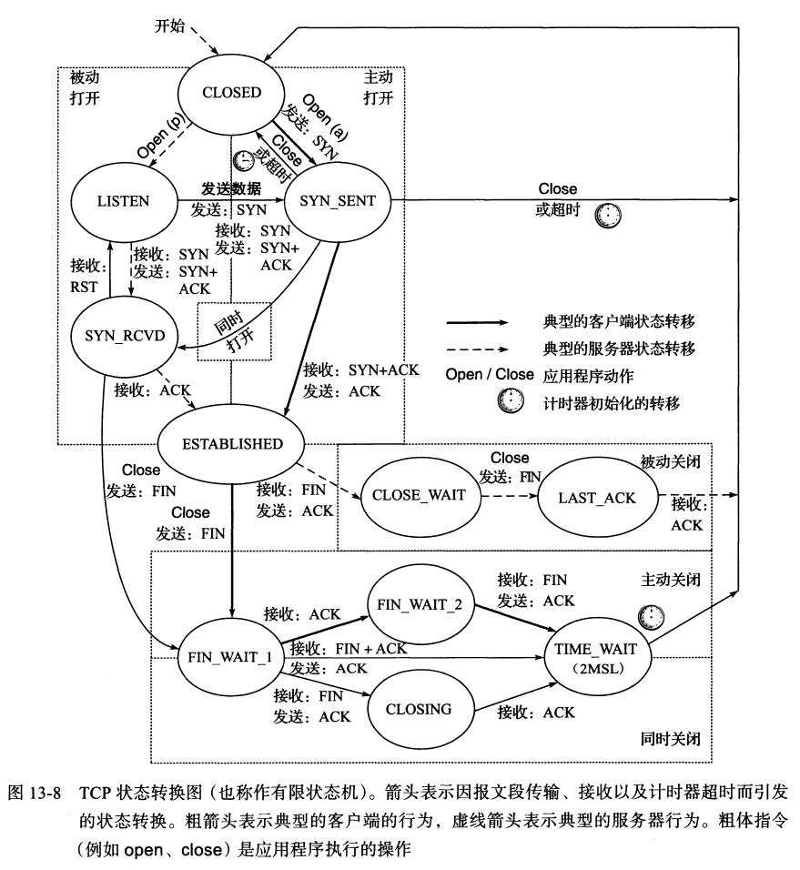
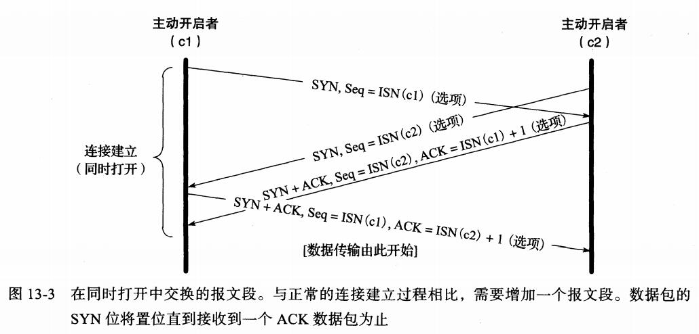
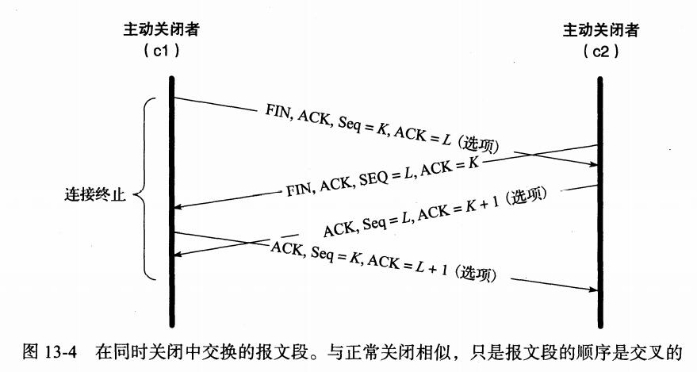
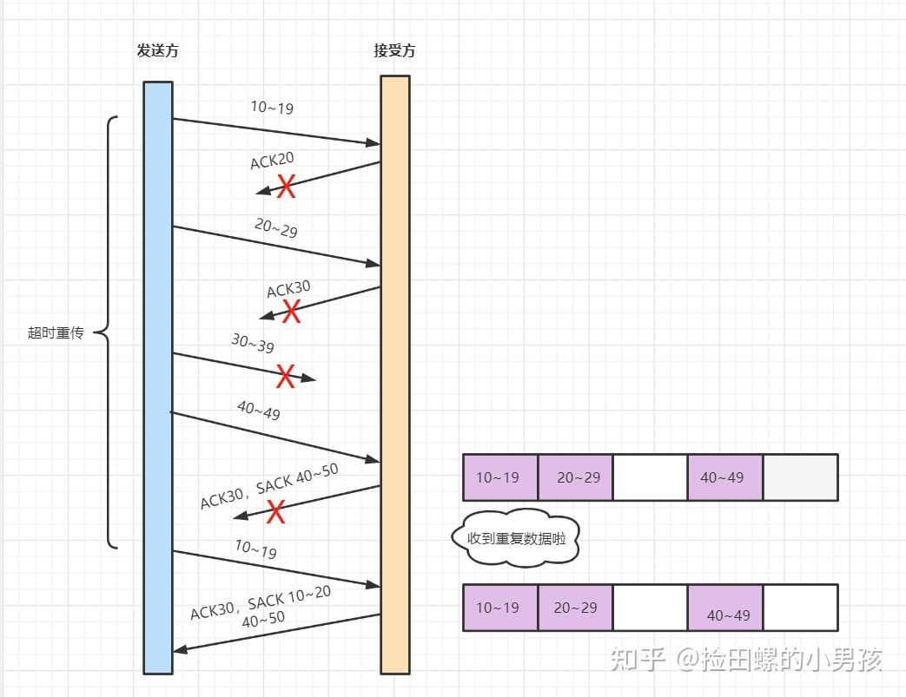
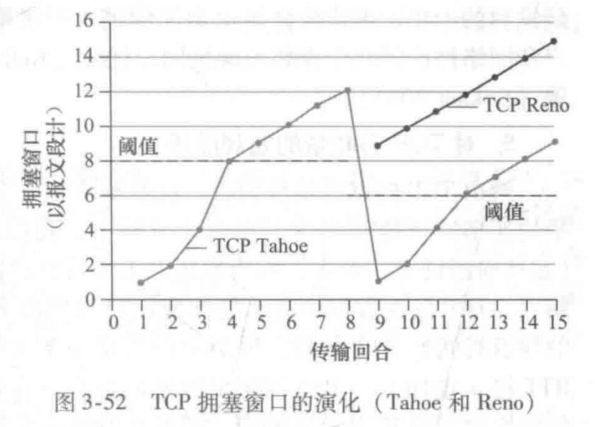
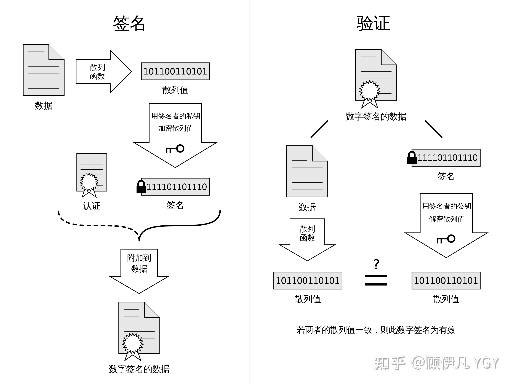

# TCP

一些关于TCP协议的细节。参考自《TCP/IP详解 卷一》

## 1 连接管理

一个正常的三次握手与四次挥手

### 1.1 三次握手和四次挥手

需要注意的点是SYN包会消耗一个序号，而ACK包不会。这是由于SYN包需要进行重传。

在三次握手建立之后连接两方的数据会分别从各自的ISN+1开始

#### 1.1.1 一些丢包失序情况

a)**客户端的SYN包丢失**，重传相同的SYN, Seq=ISN(c)即可

b)如果客户端认为SYN丢包重传，但由于路由等原因导致服务器前一个SYN包实际没丢，使得服务器收到两个相同的SYN包，那么服务器直接传两回相同的SYN+ACK包，里面的Seq仍然是ISN(s)，ACK仍为ISN(c)+1。这里的ACK仍然是累计确认的机制，与rdt中收到重复分组的处理方法相同

c)**服务器的SYN ACK包丢包**，会导致客户端怀疑自己发的SYN包丢失，处理方法同b。或者服务器长时间没收到ACK包，认为自己发的SYN ACK包丢失，重传。总之在服务器收到客户端的ACK包之前，两方都会各自超时，各自重传自己的SYN包或SYN ACK包，直到服务端收到ACK包。

d)**客户端发的ACK丢包**，此时客户端已经进入ESTABLISHED状态，则收到服务端重传的SYN ACK包之后，重传ACK包。

​		总之，只有带有SYN的包需要重传，ACK是累计确认的，因此在这种场景下收到重复SYN包直接重传并不影响ACK的累计确认，来几次就确认几次

​		SYN包和SYN ACK包的的**重传次数通常默认为5次**，且每次重传期间的**时间间隔为指数回退**。

#### 1.1.2 三次握手原因

- 三次握手的目的不仅在于让通信的双方了解一个连接正在建立，更重要的是**让双方都知道对方的起始序列号，并相互确认**。这也符合TCP面向字节流的特点，也就是流从哪个序号开始。
- 如果握手只有前两次，那只能让客户端知道自己的序列号被确认了，而不能让服务器知道自己的序列号被确认。
- 四次就不必要了，三次已经足够

#### 1.1.3 如果两方同时发起握手

需要进行4次传输。**总之只要其中的一方发出了一个SYN，且这个SYN得到了对方的ACK确认，且得到了对方的SYN，他就可以认为连接已经建立**

注意看TCP状态图中SYN_SEND向SYN_RCVD这一特殊转换，转到SYN_RCVD之后只要等来对方的

如果我发了SYN给对方，但对方只回了一个SYN没ACK，那我就可以认为对方没收到我的SYN，那我就再发一次SYN，同时附上对对方的ACK。

这时我得到了对方的序列号，且ACK了他，这时候要等的是对方ACK我的序列号。

#### 1.1.4 如果双方同时发起挥手

两方各关各的，发送FIN后收到了对方的FIN，则立即进入TIME-WAIT状态

注意看TCP状态图中直接由FIN_WAIT1转向TIME_WAIT的转换

#### 1.1.5 TIME_WAIT状态

TIME_WAIT也称为2MSL等待状态。在这一状态TCP将会等待2倍最大段生存期（MSL）的时间。RFC标准中将MSL定为2分钟，在常见实现中可定为30s，1分钟。

这一状态的设置是为了让TCP重新发送最终的ACK以避免其丢失的情况。事实上TCP总是会重传FIN直到它收到一个ACK。

某种可能不准确的说法：这是一种仁尽义至的等待，在这个时间内收到你的FIN我会再回你一次ACK。超出这个时间就直接回RST给你。

#### 1.1.6 FIN_WAIT_2状态

​		在FIN_WAIT_2状态，某一端已经发送了FIN并收到了对方的ACK确认。除非出现半关闭的情况，否则这一端会等待直到对方发FIN过来。如果对方一直待在CLOSE_WAIT状态就是不发FIN回来，就会造成发起关闭的一方在FIN_WAIT_2无限等待

​		如果发起关闭的一方执行的是完全关闭而不是半关闭，那就会设定一个定时器（Linux中默认60s），超时后还没收到对方的FIN就直接转到CLOSED状态，不等了。

### 1.2 与TCP连接相关的攻击

#### 1.2.1 SYN泛洪

也称为SYN拒绝服务攻击。许多恶意客户端向服务器发大量的SYN包，但就是不回ACK包，从而让服务器内存耗尽宕机。

主要的解决方法有SYN cookies：

- 当服务器收到SYN包之后，会将一些连接的信息哈希加密到自己生成的起始序列号中，放在SYN ACK包发给客户端
- 在服务器收到客户端发回的ACK包之后，会哈希计算结果是否匹配。匹配才会分配资源处理这条连接

## 2 TCP超时重传机制

### 2.1 带选择确认的重传

​		TCP发送端的任务是通过重传丢失的数据来填补接收端缓存中的空缺，但同时也要尽可能保证不重传已正确接收到的数据。合理采用SACK信息能更快地实现空缺填补，并能减少不必要的重传，原因在于**其在一个RTT内能获知多个空缺**。

​		在采用SACK选项时，一个ACK可以包含三四个告知失序数据的SACK信息。从而**让发送端通过这些信息进行选择重传**

### 2.2 伪超时与重传

​		很多情况下，即使没有出现数据丢失也可能引发重传。**这种不必要的重传称为伪重传。造成伪重传的主要原因是伪超时**，即过早的判定超时

#### 2.2.1 DSACK

​		RFC2883建议在收到重复报文的时候，**SACK选项的第一个块(这个块也叫做DSACK块)可以用来传递触发这个ACK确认包的系列号**，这个就是DSACK(duplicate-SACK)功能。从而帮助发送方判断是否发生伪超时、伪重传等，从而让TCP更好的做网络流控。

## 3 窗口管理

### 3.1 延时确认

在许多情况下，TCP并不对每个到来的数据包都返回ACK，利用TCP的累计确认ACK字段可以实现。

累计确认允许TCP延迟一段时间发送ACK，以便将ACK与同方向的数据结合发送，俗称“捎带”。可以一定程度减轻网络负载。

但是TCP也不能任意的延长延迟发送ACK，否则会让发送方误以为丢包造成重传。RFC1122指出延迟应当小于500ms，实践中最大取200ms。

​		

### 3.2 Nagle算法

大量的小包会造成相当高的网络传输代价，Nagle算法用于解决这一问题

- 当一个TCP连接中没有在途数据（已发送未ACK）时，**立即发送**
- 当一个TCP连接中有在传数据时，**就等到没有在途数据或小数据大小已经收集到MSS，然后再发送**

因此ACK返回的越快，数据也就传输的越快。也就是说RTT控制发包速率

对于一些时延要求较高的场景例如实时网络游戏、远程鼠标控制则不适用于Nagle算法。由于网络带宽的发展，目前的TCP/IP协议栈默认关闭Nagle算法。

### 3.3 零接收窗口与TCP持续计时器

​		当接收窗口值变为10时可有效阻止发送端继续发送1，直到窗口大小恢复为非0值。**当接收端重新获得可用空间时，会给发送端传输一个窗口更新告知发送端可以持续性发送数据**

​		但窗口更新通常不包含数据即一个纯ACK包，不能保证传输的可靠性。如果一个包含窗口更新的ACK丢失，则会造成通信双方一直等待造成死锁。

​		为了避免这样的死锁发生，**发送端使用一个持续计时器间歇性地查询接收端看其窗口是否增长，即窗口探测**。强制要求接收端返回包含接收窗口大小字段的ACK包。

​		**窗口探测包含一个字节的数据，采用TCP可靠传输**，可以避免由窗口更新丢失造成的死锁

### 3.4 糊涂窗口综合症

​		糊涂窗口综合症是指**当发送端应用进程产生数据很慢、或接收端应用进程处理接收缓冲区数据很慢，或二者兼而有之；就会使应用进程间传送的报文段很小，特别是有效载荷很小**。TCP的两端都可能导致这一问题出现：**接收端通告窗口太小，发送端发送小包**。因此有以下规则来避免这一问题：

- 对于接收端而言，**不应通告小的接收窗口**。RFC1122描述的算法中，在窗口增加至一个MSS或接收端缓存空间的一半前不能通告更大的窗口值。当接收方处理接收到的数据使可用缓存增大，或者接收到窗口探测需要强制回应时会用到这一规则
- 对于发送端而言，应当**使用Nagle算法控制报文段的发送**

## 4 拥塞控制

流量控制是端到端传输速率的匹配机制，而拥塞控制则是由于网络核心当中路由器丢包。

### 4.1 经典拥塞控制算法的一些细节

Tahoe和Reno在发生丢包后都会将阈值(ssthresh)设为丢包时窗口的一半，然后将窗口减为1，重新开始慢启动。

Tahoe在收到三个冗余ACK后处理同上。

Reno在收到三个冗余ACK后进入快速恢复阶段：

- 将阈值设为丢包此时窗口的一半
- 启用快速重传，将拥塞窗口设为阈值+3MSS
- 每接收到一个冗余的ACK就将拥塞窗口+1MSS
- 接收到一个新的ACK，将拥塞窗口设为阈值，进入拥塞避免阶段。（此阶段也称为收缩）

### 4.2 Google TCP BBR算法

参考自知乎：https://www.zhihu.com/answer/135903103

#### 4.2.1 缓冲区膨胀问题

​		网络中会存在一些缓冲区，例如路由器的buffer。在传统TCP的加性增乘性减中，是通过“灌满水管”来估算发送窗口的，在开始的阶段buffer会倾向于被占满，随后buffer的占用会逐渐减少但并不会完全消失。**客户端估计的发送窗口大小总是略大于水管中除去buffer的容积**。

缓冲区膨胀问题存在两个危害：

- **增加网络延迟**。buffer里的东西越多，buffer里的包就要等越长时间才能被路由器转发到链路上
- 在共享网络中连接较多时，可能会**导致buffer被填满发生丢包**，而传统TCP会将其视为拥塞处理

#### 4.2.2 存在丢包的长肥管道问题

​		长肥管道即延迟高但带宽大的链路。在这种存在一定丢包率的链路上进行传输时，发送窗口会涨不上去。**一旦发生一个丢包，传统TCP的加性增乘性减算法就会保守地将拥塞窗口压制减半**。所以有时候客户端和服务端都有很大带宽，运营商网络也没占满，但下载速率很慢就是上不去，这就是其中的一个原因

#### 4.2.3 TCP BBR的解决方法

​		众所周知，拥塞窗口的最合适的大小是**网络上尚未被确认收到的数据包数量=链路带宽x往返延迟**。而链路带宽和往返延迟难以同时测得，在测带宽时需要拼命将链路灌满，而这时往返延迟就不准；而在测延迟时需要链路上尽可能畅通，这时又测不出带宽了。所以TCP BBR的解决办法是：

- **既然灌满链路的方法容易造成缓冲区膨胀，那BBR就分别估计带宽和延迟**
- **既然不容易区分拥塞丢包和错误丢包，那BBR干脆就不考虑丢包**

TCP BBR解决带宽和延迟无法同时测准的办法是，交替测量带宽和延迟；**然后用一段时间内的带宽极大值和延迟极小值作为估计值**

#### 4.2.4 TCP BBR阶段描述

发送窗口和往返延迟，与带宽的对比

1. **慢启动阶段**

   ​		BBR的满期栋类似于标准TCP，也是指数增长发送窗口。**但如果丢包率不太高，BBR都会无视。然后直到发现带宽不再增长（也就是链路上的buffer开始被占用）时才停止慢启动，进入排空阶段。BBR判定带宽不再增长的标准是连续三次得到的带宽增长小于25%，因此慢启动结束时链路上会存在2倍带宽x延迟的多余包。**

2. **排空(drain)阶段**

   ​		这一阶段主要的任务是**排空链路buffer中2倍带宽x延迟的多余包**。因此这时BBR会指数降低发送速率，直到延迟不再降低为止，然后BBR进入稳定运行状态，交替探测带宽和延迟。**由于网络带宽的变化比延迟变化更频繁，因此BBR稳定状态大多数时间都处在带宽探测阶段**。

3. **带宽探测阶段**

   ​		在这一阶段**会定期的增加发包速率，如果收到ACK的速率也增加了，说明可以占用更多的带宽，继续进一步增加发包速率**。

4. **延迟探测阶段**

   ​		TCP BBR每过10秒，如果延迟没有改变，就进入延迟探测阶段，这时候将发送窗口固定为4个包，持续200ms。使用这段时间内测得的延迟极小值作为新的延迟

## 5 HTTPS

### 5.1 对称加密

即仅存在一个密钥，它可以对报文进行加密，也可以对密文进行解密

使用对称加密的问题在于密钥没有办法安全的传输给连接的另一方。

### 5.2 非对称加密

即存在一个公钥和一个私钥。**使用公钥加密的密文只能使用私钥解密，使用私钥加密的密文只能使用公钥解密**。

如果该连接两方都各使用一对公钥和私钥进行非对称加密，那么会非常耗时

### 5.3 非对称加密+对称加密

- 浏览器向服务器发起请求
- 服务器向浏览器返回自己的公钥
- 浏览器随机生成一个对称密钥，使用服务器公钥加密后发回给服务器
- 服务器解密使用私钥解密后得到对称密钥
- 连接两端开始安全传输

这样做的问题是会存在**中间人攻击**。

​		黑客可以在浏览器和服务器中间拦截报文，用黑客的公钥私钥与客户端建立连接获取对称密钥，再通过对称密钥重复上述流程与服务器建立连接，从而使得黑客可以经手所有浏览器与服务器之间的信息。

### 5.4 数字证书

中间人攻击的问题在于**浏览器无法辨别自己收到的公钥是否是服务器的真实公钥**。

因此引入CA机构签署权威性的证书来保证服务器公钥不被篡改。

数字签名的制作过程：

- CA拥有一对公钥和私钥
- CA将数据进行哈希
- 将得到的哈希值使用私钥加密，得到数字签名

数字签名和数据明文共同组成了数字证书。（注意，这里数据是明文，也就是说**数字证书只是用来验证数据明文有没有被篡改过，以及证书有没有被掉包**。这里放的一般是服务器公钥和一些网站信息，不用加密）

浏览器验证签名的过程：

- 浏览器收到数字证书，取得数字签名和明文数据
- 浏览器使用CA的公钥对数字签名进行解密，得到数据哈希值
- 浏览器使用证书里指明的哈希算法对明文数据进行哈希，和签名里解密得到的哈希值比对
- 如果两个哈希值相同，验证成功。如果不相同，则说明证书明文数据可能已被篡改，验证失败

**数字证书无法被篡改：**

​		如果证书的明文数据被篡改了，那么在浏览器哈希比对的时候就会发现异常，认定证书不可信，终止传输信息。如果中间人想篡改明文数据的同时把数字签名也改了，这是不可能的。前面提到数组签名的产生需要使用CA机构的私钥，这个私钥中间人是获取不到的。

**数字证书无法被掉包：**

​		CA签发的证书中会包含网站的域名等信息，如果中间人拿了一个合法的CA证书想掉包，就会被浏览器发现网站不符，从而发现异常。

（注：如果中间人是CA机构的内鬼，那就没办法了23333）